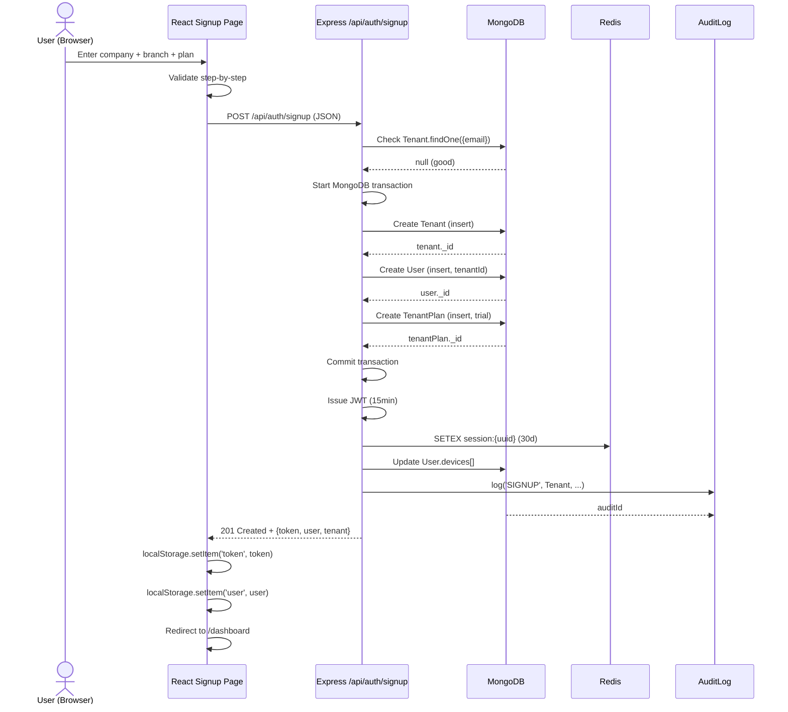

# User Registration & Tenant Onboarding Flow

## 📋 Overview

This document details the complete **multi-step tenant signup process** that transforms a website visitor into an active, authenticated tenant with a 14-day trial subscription.

**Key Outcome:** Creates 3 core entities atomically:
1. **Tenant** (the business/company)
2. **User** (admin/owner of the tenant)
3. **TenantPlan** (trial subscription with usage tracking)

---

## 🎯 Business Requirements

**Goal:** Provide frictionless onboarding for new businesses while collecting:
- ✅ Business identity (name, email, phone, address)
- ✅ Branch/location info (multi-location capable from day 1)
- ✅ Billing settings (currency, timezone, tax config)
- ✅ Plan selection (trial → paid)
- ✅ Admin credentials (email/password)

**Constraints:**
- Must be **multi-tenant** from first request (tenantId isolation)
- Must create **initial admin user** with 'owner' role
- Must enable **2FA setup** after signup (encouraged but optional on signup)
- Must generate **14-day trial** automatically
- Must create **Stripe customer** if plan is paid (not trial)

---

## 📊 High-Level Flow

```mermaid
flowchart TD
    Start([Visitor visits<br/>bikeflow.com]) --> A[Click "Sign Up"]
    A --> B[Step 1: Company Details<br/>name, email, phone, password]
    B --> C{Validation}
    C -->|Invalid| B
    C -->|Valid| D[Step 2: Branch Setup<br/>name, address, timezone, currency]
    D --> E{Validation}
    E -->|Invalid| D
    E -->|Valid| F[Step 3: Plan Selection<br/>trial/basic/pro/enterprise]
    F --> G[Step 4: Review & Confirm]
    G --> H[Submit Signup]
    H --> I[Backend: Create Tenant + User + Trial]
    I --> J[Send Welcome Email (future)]
    I --> K[Auto-login & Redirect to Dashboard]
    K --> L[Prompt 2FA Setup (if not done)]
    L --> M{Dashboard Loaded}
    M --> N[Complete]

    style A fill:#e1f5fe
    style H fill:#fff3e0
    style K fill:#e8f5e8
    style L fill:#f3e5f5
```

**Total Steps:** 4 form pages + backend processing + auto-login

**Time to Complete:** ~2-3 minutes for typical user

---

## 🖥️ Frontend Steps (Signup.jsx)

**File:** `FRONTEND/src/pages/Signup.jsx` (~17KB)

**State Machine:**
```javascript
const [step, setStep] = useState(1);  // 1, 2, 3, 4
const [formData, setFormData] = useState({
  // Step 1
  tenantName: '',
  email: '',
  phone: '',
  password: '',
  confirmPassword: '',

  // Step 2
  branchName: '',
  branchAddress: '',
  branchCity: '',
  branchState: '',
  branchZip: '',
  branchPhone: '',
  timezone: 'UTC',
  currency: 'USD',

  // Step 3
  planSlug: 'trial',

  // Step 4 (read-only review)
});
const [loading, setLoading] = useState(false);
const [error, setError] = useState(null);
```

---

### **Step 1: Company Details**

**Fields:**
- Tenant Name (text, required)
- Email (email, required, unique check)
- Phone (tel, optional)
- Password (password, min 8 chars, required)
- Confirm Password (must match)

**Validation:**
```javascript
const validateStep1 = () => {
  const { tenantName, email, password, confirmPassword } = formData;

  if (!tenantName.trim()) return 'Company name is required';
  if (!email.trim()) return 'Email is required';
  if (!isValidEmail(email)) return 'Invalid email format';
  if (password.length < 8) return 'Password must be at least 8 characters';
  if (password !== confirmPassword) return 'Passwords do not match';

  return null;  // Valid
};
```

**On Valid:**
```javascript
setStep(2);  // Move to next step
```

---

### **Step 2: Branch Setup**

**Purpose:** Configure primary business location

**Fields:**
- Branch Name (e.g., "Main Street", "Downtown Store")
- Address (street, city, state, zip, phone)
- Timezone (select from `FRONTEND/src/data/locations.json`)
- Currency (USD, EUR, INR, etc.)

**Validation:**
```javascript
const validateStep2 = () => {
  const { branchName, branchCity, branchState, branchZip, timezone, currency } = formData;

  if (!branchName.trim()) return 'Branch name is required';
  if (!branchCity.trim()) return 'City is required';
  if (!branchState.trim()) return 'State is required';
  if (!branchZip.trim()) return 'ZIP code is required';
  if (!timezone) return 'Timezone is required';
  if (!currency) return 'Currency is required';

  return null;
};
```

**On Valid:**
```javascript
setStep(3);
```

---

### **Step 3: Plan Selection**

**Display:** Available plans from `GET /api/billing/plans`

**Plans (from Plan model):**
```json
[
  {
    "slug": "trial",
    "name": "Free Trial",
    "description": "14-day free trial",
    "price": 0,
    "cycleType": "monthly",
    "limits": { "apiCalls": 100, "invoices": 50, "users": 1, "storageMB": 500 },
    "features": ["1 branch", "100 products", "Basic support"]
  },
  {
    "slug": "basic",
    "name": "Basic",
    "price": 29,
    "cycleType": "monthly",
    "limits": { "apiCalls": 1000, "invoices": 200, "users": 3, "storageMB": 5000 },
    "features": ["Up to 3 users", "500 products", "Email support"]
  },
  {
    "slug": "pro",
    "name": "Pro",
    "price": 99,
    "cycleType": "monthly",
    "limits": { "apiCalls": 10000, "invoices": 1000, "users": 10, "storageMB": 50000 },
    "features": ["10 users", "Unlimited products", "Phone support"]
  },
  {
    "slug": "enterprise",
    "name": "Enterprise",
    "price": 299,
    "cycleType": "yearly",
    "limits": { "apiCalls": null, "invoices": null, "users": -1, "storageMB": -1 },
    "features": ["Unlimited everything", "Dedicated support", "Custom features"]
  }
]
```

**Selection:** Radio buttons or cards, one plan selected
**Default:** `trial`

**On Valid:**
```javascript
setStep(4);
```

---

### **Step 4: Review & Submit**

**Summary Panel:**
```
Company: Acme Bike Shop
Email: admin@acmebikes.com
Phone: +1 (555) 123-4567

Branch: Main Street Store
Address: 123 Main St, City, ST 12345
Timezone: America/New_York
Currency: USD

Selected Plan: Basic ($29/month)
Billing Cycle: Monthly

By creating account, you agree to our Terms of Service.
Trial will expire in 14 days. Cancel anytime.
```

**Buttons:**
- **Back** → `setStep(3)`
- **Create Account** → Submit (loading spinner while API call)

---

## 🔙 Backend Processing (`POST /api/auth/signup`)

**File:** `BACKEND/src/controllers/authController.js:signup`

### **Step-by-Step Execution**

#### **1. Receive & Validate Request Body**

```javascript
exports.signup = async (req, res) => {
  const {
    tenantName,
    email,
    phone = '',
    password,
    branchName,
    branchAddress = '',
    branchCity = '',
    branchState = '',
    branchZip = '',
    branchPhone = '',
    timezone = 'UTC',
    currency = 'USD',
    planSlug = 'trial'
  } = req.body;

  // Validation
  if (!tenantName || !email || !password || !branchName) {
    return res.status(400).json({
      message: 'Missing required fields',
      required: ['tenantName', 'email', 'password', 'branchName']
    });
  }

  if (password.length < 8) {
    return res.status(400).json({ message: 'Password must be at least 8 characters' });
  }

  // Check if tenant email already exists
  const existingTenant = await Tenant.findOne({ email });
  if (existingTenant) {
    return res.status(409).json({ message: 'Tenant with this email already exists' });
  }
```

---

#### **2. Begin MongoDB Transaction** (Atomicity)

**Why Transaction?** We need to create Tenant, User, and TenantPlan atomically. Either all succeed or all fail.

```javascript
  const session = await mongoose.startSession();
  session.startTransaction();

  try {
    // ... all DB operations inside transaction
  } catch (err) {
    await session.abortTransaction();
    session.end();
    return res.status(500).json({ message: 'Signup failed', error: err.message });
  }
```

---

#### **3. Create Tenant Document**

```javascript
    // Generate trial end date (14 days from now)
    const trialEndsAt = new Date();
    trialEndsAt.setDate(trialEndsAt.getDate() + 14);

    // Build branches array
    const branches = [{
      _id: new mongoose.Types.ObjectId(),
      name: branchName,
      address: branchAddress,
      city: branchCity,
      state: branchState,
      zip: branchZip,
      phone: branchPhone || '',
      timezone,
      currency,
    }];

    // Create Tenant
    const tenant = new Tenant({
      name: tenantName,
      email,
      phone: phone || '',
      status: 'active',  // Active until trial expires (then must upgrade)
      branches,
      settings: {
        timezone,
        currency,
        gst_enabled: false,
        vat_enabled: false,
      },
      billing: {
        sameAsBusiness: true,
        name: tenantName,
        email,
        phone: phone || '',
        address: branchAddress,
        city: branchCity,
        state: branchState,
        zip: branchZip,
        currency,
      },
      trial: {
        startedAt: new Date(),
        endsAt: trialEndsAt,
      }
    });

    await tenant.save({ session });
```

**Result:**
```json
{
  "_id": "65f4a3b8e4b0123456789xyz",
  "name": "Acme Bike Shop",
  "email": "admin@acmebikes.com",
  "status": "active",
  "branches": [{ "_id": "...", "name": "Main Street", ... }],
  "settings": { "timezone": "America/New_York", "currency": "USD" },
  "trial": { "startedAt": "2024-03-15T10:00:00Z", "endsAt": "2024-03-29T10:00:00Z" },
  "createdAt": "2024-03-15T10:00:00Z"
}
```

---

#### **4. Create User Document (Admin/Owner)**

```javascript
    // Hash password
    const passwordHash = await bcryptjs.hash(password, 10);

    // Create user (owner role, multi-tenant)
    const user = new User({
      tenantId: tenant._id,  // CRITICAL: link to tenant
      name: tenantName,      // Use tenant name initially
      email,
      passwordHash,
      role: 'owner',         // Full permissions
      status: 'active',
      totpEnabled: false,    // 2FA not yet setup
      backupCodes: [],       // Will generate after 2FA setup
      devices: [],           // No active sessions yet
    });

    await user.save({ session });
```

**Result:**
```json
{
  "_id": "65f4a3b8e4b0123456789abc",
  "tenantId": "65f4a3b8e4b0123456789xyz",
  "name": "Acme Bike Shop",
  "email": "admin@acmebikes.com",
  "role": "owner",
  "totpEnabled": false,
  "createdAt": "2024-03-15T10:00:00Z"
}
```

---

#### **5. Create TenantPlan (Trial Subscription)**

**We need a TenantPlan for usage tracking, even for trial.**

```javascript
    // Load plan from catalog (slug: 'trial')
    const plan = await Plan.findOne({ slug: planSlug, isActive: true });
    if (!plan) {
      throw new Error(`Plan '${planSlug}' not found`);
    }

    // Calculate trial period
    const now = new Date();
    const trialEndDate = new Date();
    trialEndDate.setDate(trialEndDate.getDate() + 14);

    // Create TenantPlan
    const tenantPlan = new TenantPlan({
      tenantId: tenant._id,
      planId: plan._id,
      status: 'trialing',
      gateway: null,           // No payment gateway for trial
      gatewayCustomerId: null,
      gatewaySubscriptionId: null,
      startDate: now,
      endDate: trialEndDate,
      currentPeriodStart: now,
      currentPeriodEnd: trialEndDate,
      nextBillingDate: trialEndDate,  // Upgrade before this date
      cancelAtPeriodEnd: false,
      cancelAt: null,
      renewalInterval: 'monthly',  // Default cycle
      usage: {
        invoiceCount: 0,
        apiCallsThisMonth: 0,
        activeUsers: 1,  // Admin user
        storageMB: 0,
      },
      metadata: {
        planName: plan.name,
        planPrice: plan.price,
      },
    });

    await tenantPlan.save({ session });
```

**Result:**
```json
{
  "_id": "65f4a3b8e4b0123456789def",
  "tenantId": "65f4a3b8e4b0123456789xyz",
  "planId": "65f4a3b8e4b0123456789abc",
  "status": "trialing",
  "startDate": "2024-03-15T10:00:00Z",
  "endDate": "2024-03-29T10:00:00Z",
  "usage": { "invoiceCount": 0, "apiCallsThisMonth": 0, "activeUsers": 1, "storageMB": 0 },
  "createdAt": "2024-03-15T10:00:00Z"
}
```

---

#### **6. Commit Transaction**

```javascript
    await session.commitTransaction();
    session.end();
```

**All-or-nothing:**
- If any `save()` fails → `abortTransaction()` → no data created
- If all succeed → `commitTransaction()` → Tenant + User + TenantPlan persisted

---

#### **7. Issue JWT**

**Payload:**
```javascript
const token = jwt.sign(
  {
    userId: user._id,
    tenantId: tenant._id,
    role: user.role,  // 'owner'
  },
  process.env.JWT_SECRET,
  { expiresIn: '15m' }  // Short expiry for security
);
```

**Token (decoded):**
```json
{
  "userId": "65f4a3b8e4b0123456789abc",
  "tenantId": "65f4a3b8e4b0123456789xyz",
  "role": "owner",
  "iat": 1711699200,
  "exp": 1711702800
}
```

---

#### **8. Create Redis Session**

**Key:** `session:{uuid}`

```javascript
    const sessionId = uuidv4();
    const sessionData = {
      userId: user._id,
      tenantId: tenant._id,
      userAgent: req.headers['user-agent'],
      ipAddress: req.ip,
      createdAt: new Date(),
    };

    await redis.setex(
      `session:${sessionId}`,
      86400 * 30,  // 30 days expiration
      JSON.stringify(sessionData)
    );
```

---

#### **9. Update User with Session Device**

```javascript
    user.devices.push({
      deviceId: sessionId,
      userAgent: req.headers['user-agent'],
      ipAddress: req.ip,
      lastUsedAt: new Date(),
      isActive: true,
    });

    await user.save({ session: null });  // New session after commit
```

---

#### **10. Log Activity to AuditLog**

```javascript
    await ActivityLogger.log(
      user._id,
      'SIGNUP',
      'Tenant',
      tenant._id,
      {},  // before (empty)
      { tenant: tenant.name, email, plan: planSlug }  // after
    );
```

---

#### **11. Send Response**

```javascript
    res.status(201).json({
      message: 'Signup successful',
      token,
      user: {
        id: user._id,
        name: user.name,
        email: user.email,
        role: user.role,
        totpEnabled: false,
      },
      sessionId,
      tenant: {
        id: tenant._id,
        name: tenant.name,
        trialEndsAt: tenant.trial.endsAt,
        plan: planSlug,
        branch: branches[0],
      },
    });
```

---

## 🔄 Complete Signup Sequence



---

## 🔐 Security Considerations

### **Email Uniqueness**
```javascript
const existingTenant = await Tenant.findOne({ email });
if (existingTenant) return 409 Conflict;
```
**Note:** Could allow same person to create multiple tenants with same email if they own multiple businesses? Current design blocks this.

**Alternative:** Store `tenantId + email` unique index in User model only (allows same email across different tenants, but not within same tenant).

---

### **Password Strength**
**Current:** Only checks `length >= 8`

**Missing:**
- Complexity requirements (uppercase, lowercase, number, special)
- Breached password check (HIBP API)
- Password reuse prevention
- Rate limiting on signup IP (already has IP rate limit)

---

### **Transaction Atomicity**
All 3 writes (Tenant, User, TenantPlan) happen in single MongoDB transaction.

**If TenantPlan creation fails:** Entire transaction aborts, no partial state (orphaned tenant/user).

**Benefit:** No cleanup needed for failed signups.

---

### **JWT Security**
- **Expiry:** 15 minutes (short)
- **Secret:** From `JWT_SECRET` env var (must be strong random string)
- **Payload:** Minimal (userId, tenantId, role) - no sensitive data
- **Storage:** Frontend localStorage (vulnerable to XSS, but standard for SPAs)
- **Refresh:** Not implemented yet - user must re-login after 15min (bad UX). Need refresh tokens.

---

### **Session Security**
- **Storage:** Redis (not localStorage)
- **Expiry:** 30 days (configurable)
- **Device tracking:** User-Agent + IP stored
- **Revocation:** User can revoke sessions from `/auth/sessions` page
- **Multiple sessions:** Allowed (multi-device)

---

## 🔧 Error Handling

### **Validation Errors (400)**
```json
{
  "message": "Missing required fields",
  "required": ["tenantName", "email", "password", "branchName"]
}
```

### **Conflict (409)**
```json
{
  "message": "Tenant with this email already exists"
}
```

### **Server Error (500)**
```json
{
  "message": "Signup failed",
  "error": "MongoServerError: E11000 duplicate key error collection..."
}
```

**Note:** In production, `error` field may be omitted for security (don't leak DB details).

---

## 📸 Post-Signup Experience

### **Auto-Login**

Frontend receives `{ token, user, tenant }` and:
1. `localStorage.setItem('token', token)`
2. `localStorage.setItem('user', JSON.stringify(user))`
3. Navigate to `/dashboard`

**User is now authenticated** without clicking "Login".

---

### **Dashboard First Load**

**Dashboard.jsx** calls:
```javascript
useEffect(() => {
  // Fetch dashboard data
  Promise.all([
    usageAPI.getDashboard(),      // Usage + rate limit status
    salesAPI.getTodaysSales(),    // Today's revenue
    inventoryAPI.getLowStockItems(10),  // Low stock alerts
    salesAPI.getTopProducts(5),   // Top selling products
  ]).then(([usage, sales, lowStock, topProducts]) => {
    setUsage(usage.data);
    setSales(sales.data);
    setLowStock(lowStock.data);
    setTopProducts(topProducts.data);
  });
}, []);
```

**2FA Prompt:**
If `user.totpEnabled === false`, dashboard shows banner:
```
⚡ Secure your account: Enable Two-Factor Authentication (2FA)
[Enable 2FA] [Dismiss]
```

Clicking **Enable 2FA**:
1. Calls `POST /api/auth/2fa/setup`
2. Receives `{ secret, qrCodeDataUrl }`
3. Shows QR code modal
4. User scans with Google Authenticator / Authy
5. Enters 6-digit code
6. Saves backup codes
7. `POST /api/auth/2fa/confirm` with `{ totp, backupCodes }`
8. `user.totpEnabled` now `true` (frontend state update)

---

## 🗄️ Database State After Signup

### **Tenant Collection**
```json
{
  "_id": "65f4a3b8e4b0123456789xyz",
  "name": "Acme Bike Shop",
  "email": "admin@acmebikes.com",
  "phone": "+1 (555) 123-4567",
  "status": "active",
  "branches": [
    {
      "_id": "65f4a3b8e4b0123456789uvw",
      "name": "Main Street",
      "address": "123 Main St",
      "city": "Anytown",
      "state": "CA",
      "zip": "12345",
      "phone": "+1 (555) 987-6543",
      "timezone": "America/New_York",
      "currency": "USD"
    }
  ],
  "settings": {
    "timezone": "America/New_York",
    "currency": "USD",
    "gst_enabled": false,
    "vat_enabled": false
  },
  "trial": {
    "startedAt": "2024-03-15T10:00:00Z",
    "endsAt": "2024-03-29T10:00:00Z"
  },
  "createdAt": "2024-03-15T10:00:00Z",
  "updatedAt": "2024-03-15T10:00:00Z"
}
```

---

### **User Collection**
```json
{
  "_id": "65f4a3b8e4b0123456789abc",
  "tenantId": "65f4a3b8e4b0123456789xyz",
  "name": "Acme Bike Shop",
  "email": "admin@acmebikes.com",
  "passwordHash": "$2a$10$...bcrypt hash...",
  "role": "owner",
  "totpEnabled": false,
  "totpSecret": null,
  "backupCodes": [],
  "status": "active",
  "lastLoginAt": "2024-03-15T10:05:00Z",
  "lastLoginIp": "203.0.113.42",
  "devices": [
    {
      "deviceId": "abc123-def456",
      "userAgent": "Mozilla/5.0 (Windows NT 10.0; Win64; x64) AppleWebKit/...",
      "ipAddress": "203.0.113.42",
      "lastUsedAt": "2024-03-15T10:05:00Z",
      "isActive": true
    }
  ],
  "customPermissions": [],
  "createdAt": "2024-03-15T10:00:00Z",
  "updatedAt": "2024-03-15T10:05:00Z"
}
```

---

### **TenantPlan Collection**
```json
{
  "_id": "65f4a3b8e4b0123456789def",
  "tenantId": "65f4a3b8e4b0123456789xyz",
  "planId": "65f4a3b8e4b0123456789abc",  // Ref to Plan document
  "status": "trialing",
  "gateway": null,
  "gatewayCustomerId": null,
  "gatewaySubscriptionId": null,
  "startDate": "2024-03-15T10:00:00Z",
  "endDate": "2024-03-29T10:00:00Z",
  "currentPeriodStart": "2024-03-15T10:00:00Z",
  "currentPeriodEnd": "2024-03-29T10:00:00Z",
  "nextBillingDate": "2024-03-29T10:00:00Z",
  "cancelAtPeriodEnd": false,
  "canceledAt": null,
  "renewalInterval": "monthly",
  "usage": {
    "invoiceCount": 0,
    "apiCallsThisMonth": 0,
    "activeUsers": 1,
    "storageMB": 0
  },
  "metadata": {
    "planName": "Free Trial",
    "planPrice": 0
  },
  "createdAt": "2024-03-15T10:00:00Z"
}
```

---

### **AuditLog Collection**
```json
{
  "_id": "65f4a3d9e4b0987654321ghi",
  "tenantId": "65f4a3b8e4b0123456789xyz",
  "userId": "65f4a3b8e4b0123456789abc",
  "action": "SIGNUP",
  "resource": "Tenant",
  "resourceId": "65f4a3b8e4b0123456789xyz",
  "before": {},
  "after": {
    "name": "Acme Bike Shop",
    "email": "admin@acmebikes.com",
    "plan": "trial"
  },
  "status": "success",
  "ipAddress": "203.0.113.42",
  "createdAt": "2024-03-15T10:00:05Z"
}
```
**TTL:** Auto-deleted after 90 days (index `{ createdAt: 1 }` with `expireAfterSeconds: 7776000`)

---

## 🔄 Subsequent Login Flow

Once signed up, user can log in anytime.

**Flow:** See [04-authentication-flow.md](04-authentication-flow.md)

**Key Points:**
1. `POST /api/auth/login` with email + password
2. Validate password
3. Check 2FA if enabled (`user.totpEnabled === true`)
   - If enabled: return `{ requires2FA: true, tempToken }` (2min expiry)
   - Frontend redirects to 2FA form, enters TOTP
   - `POST /api/auth/2fa/verify` with tempToken + totp
   - If valid → issue real JWT
4. If 2FA not enabled: issue real JWT immediately
5. Create session in Redis (device tracking)
6. Return `{ token, user, sessionId }`
7. Frontend stores token → authenticated

---

## 📊 Edge Cases & Business Rules

### **1. Trial Limit Exceeded**

**Rule:** One trial per email address (current implementation)

```javascript
const existingTenant = await Tenant.findOne({ email });
if (existingTenant) return 409;
```

**Business Decision:** Prevent abuse (one business = one trial). If they need second trial (different business), use different email.

**Future:** Allow multiple trials if different business name? Need fraud detection.

---

### **2. Trial Period Length**

**Fixed:** 14 days from signup

```javascript
const trialEndsAt = new Date();
trialEndsAt.setDate(trialEndsAt.getDate() + 14);
```

**Future:** Make configurable by plan? Marketing promotion extension?

---

### **3. Initial Branch Required**

**Requirement:** Every tenant must have at least 1 branch at signup.

**Why:** Multi-branch support is core feature. Don't allow tenant with 0 branches.

**UI:** Step 2 collects branch info (required field).

---

### **4. Currency & Timezone Default**

**If user skips:** Default to `UTC` and `USD`

```javascript
timezone = timezone || 'UTC';
currency = currency || 'USD';
```

**Future:** Detect from IP geolocation? Browser timezone?

---

### **5. Plan Selection - Trial vs Paid**

**If trial selected:**
- No Stripe customer created
- No webhook setup
- `TenantPlan.gateway = null`
- `TenantPlan.status = 'trialing'`
- 14-day countdown starts

**If paid selected (basic/pro/enterprise):**
- Create Stripe customer immediately (in signup? or at checkout?)
- Current flow: User selects paid plan at signup → **BUT** still creates trial TenantPlan?
- **Question:** Should paid plan skip trial and create active subscription immediately?
  - Answer: No, paid plans should go through checkout flow after signup
  - Better: Signup always creates trial, then upgrade via `/api/billing/subscription`

**Current Implementation:**
- Frontend `planSlug` can be 'basic', 'pro', etc.
- Backend still creates trial TenantPlan regardless of planSlug
- User then clicks "Upgrade" on dashboard to go through checkout
- Checkout creates real subscription via Stripe → webhook updates TenantPlan

**Issue:** Why select paid plan at signup if it's still trial? May confuse users.

**Recommendation:** Hide paid plans on signup, only show trial. Or if paid selected, skip trial and go straight to checkout.

---

### **6. Email Already Exists (Tenant)**

**Current:** `409 Conflict` with message

**UX:** Frontend should show friendly error: "A business with this email already exists. Did you forget your password? [Reset] or [Login with different email]"

---

### **7. Concurrent Signup (Race Condition)**

**Scenario:** Two people try to sign up with same email at same time.

**MongoDB Unique Index:**
```javascript
tenantSchema.index({ email: 1 }, { unique: true });
```

**Second request will fail:**
```javascript
try {
  await tenant.save({ session });
} catch (err) {
  if (err.code === 11000) {  // Duplicate key error
    return res.status(409).json({ message: 'Tenant already exists' });
  }
  throw err;
}
```

**Transaction ensures both requests don't both succeed.**

---

### **8. Database Connection Lost**

**If MongoDB down during signup:**
```javascript
const session = await mongoose.startSession();
// throws error
```

**Catch block:**
```javascript
catch (err) {
  await session.abortTransaction();
  session.end();
  return res.status(500).json({ message: 'Signup failed. Please try again.' });
}
```

**User sees:** "Signup failed. Please try again." - generic message (no DB details leaked).

---

### **9. Redis Unavailable (Session Creation)**

**If Redis down:**
```javascript
await redis.setex(...)  // throws error
```

**Current code:** No try-catch around Redis ops in signup (should add!)

**Impact:** Session won't be created → user can't maintain login across refreshes

**Fix:**
```javascript
try {
  await redis.setex(`session:${sessionId}`, 86400 * 30, JSON.stringify(sessionData));
} catch (err) {
  console.error('Redis session creation failed:', err);
  // Continue anyway - user still logged in for this session (JWT valid)
  // But no persistent session across refreshes without Redis
}
```

---

## 🧪 Testing Scenarios

### **Happy Path**
```
Input:
  tenantName: "Acme Bike Shop"
  email: "admin@acmebikes.com"
  password: "SecurePass123!"
  branchName: "Main St"
  timezone: "America/New_York"
  currency: "USD"
  planSlug: "trial"

Expected Result:
  201 Created
  {
    "token": "eyJhbG...",
    "user": { "id": "...", "role": "owner", "totpEnabled": false },
    "tenant": { "id": "...", "name": "Acme Bike Shop", "trialEndsAt": "...", plan: "trial" }
  }
  MongoDB: Tenant, User, TenantPlan created
  Redis: session key created
  AuditLog: SIGNUP event logged
```

---

### **Validation Failure (Step 1)**
```
Input:
  tenantName: ""
  email: "invalid-email"
  password: "123"

Expected Result:
  400 Bad Request with validation messages
  No database writes
```

---

### **Email Conflict**
```
First request: 201 (success)
Second request with same email: 409 Conflict
```

---

### **Database Transaction Rollback**
```
Scenario: TenantPlan planSlug doesn't exist (Plan.findOne returns null)

Expected:
  500 Internal Server Error
  All three DB writes rolled back (no Tenant, User, or TenantPlan persisted)
  Transaction aborted
```

---

### **Redis Down**
```
Redis not running

Expected:
  - Tenant, User, TenantPlan created (MongoDB transaction commits)
  - Session creation fails (Redis error logged)
  - Response still 201 with JWT
  - User can use app for this browser session (JWT in localStorage)
  - But session won't persist in Redis, so:
    - Can't revoke session from other devices (won't appear in list)
    - 30-day "remember me" might not work across browser restarts
    - Rate limiting may still work (Redis required)
```

---

## 📈 Performance

**Signup API (POST /api/auth/signup)**

| Operation | Time |
|-----------|------|
| Body validation | <1ms |
| Tenant.findOne({email}) | ~5ms |
| bcrypt.hash(password) | ~100-200ms (intentional - slow hash) |
| MongoDB transaction (3 inserts) | ~10-20ms |
| JWT sign | <1ms |
| Redis setex | ~2ms |
| AuditLog insert | ~10ms |
| **Total (p50)** | ~150-250ms |

**Bottleneck:** Bcrypt hashing (intentionally slow for security). Can be moved to background job if needed (but need password immediately for login).

**Optimization:** Use `bcryptjs` (pure JS) vs `bcrypt` (native, faster but compilation issues). Current: `bcryptjs` ≈ 100-200ms for 10 rounds.

---

## 📝 Frontend Form Implementation

**Key Code Patterns:**

```javascript
// State management
const [step, setStep] = useState(1);
const [formData, setFormData] = useState(initialFormData);

// Navigation
const nextStep = () => {
  const error = validateStep(step);
  if (error) {
    setError(error);
    return;
  }
  setError(null);
  setStep(step + 1);
};

// API call
const handleSubmit = async () => {
  setLoading(true);
  setError(null);

  try {
    const response = await authAPI.signup(formData);
    const { token, user, tenant } = response.data;

    // Persist auth state
    localStorage.setItem('token', token);
    localStorage.setItem('user', JSON.stringify(user));

    // Redirect
    navigate('/dashboard');
  } catch (err) {
    setError(err.response?.data?.message || 'Signup failed');
  } finally {
    setLoading(false);
  }
};

// Render step-specific form
return (
  <div>
    {step === 1 && <CompanyForm formData={formData} onChange={setFormData} />}
    {step === 2 && <BranchForm formData={formData} onChange={setFormData} />}
    {step === 3 && <PlanSelector formData={formData} onChange={setFormData} />}
    {step === 4 && <ReviewPanel formData={formData} />}

    <div className="navigation">
      {step > 1 && <button onClick={() => setStep(step - 1)}>Back</button>}
      {step < 4 && <button onClick={nextStep}>Next</button>}
      {step === 4 && <button onClick={handleSubmit} disabled={loading}>Create Account</button>}
    </div>

    {error && <div className="error">{error}</div>}
  </div>
);
```

---

## 🔐 Security Checklist

- [x] Email uniqueness enforced (409 on conflict)
- [x] Password hashed with bcrypt (10 rounds)
- [x] TenantId linking (User.tenantId = Tenant._id)
- [x] Transaction atomicity (all-or-nothing)
- [x] JWT short expiry (15min)
- [x] Session in Redis (not localStorage)
- [x] IP rate limiting (100/hr global)
- [x] Audit log (immutable SIGNUP event)
- [ ] Rate limit per email (prevent brute force signup)
- [ ] CAPTCHA (prevent bots)
- [ ] Password complexity rules
- [ ] Email verification (resend verification email, require before login)
- [ ] HIBP breached password check
- [ ] Refresh tokens (currently JWT only, 15min re-login needed)

---

## 🚀 Future Enhancements

1. **Email Verification Flow**
   - Send verification email with link
   - Mark `Tenant.emailVerified = false` until clicked
   - Block login until verified

2. **Social Login** (Google, Microsoft)
   - OAuth2 flow
   - Auto-create tenant from social profile

3. **Multi-Branch at Signup**
   - Allow adding 2+ branches in Step 2 (add/remove branch fields)

4. **Plan-Specific Trial Extensions**
   - Pro plan: 30-day trial
   - Enterprise: 60-day trial

5. **Invitation-Based Signup**
   - Owner invites users via email
   - Invited user sets own password (skip signup)

6. **Onboarding Wizard**
   - Post-signup: Guided tour of dashboard
   - "Add your first product" walkthrough
   - "Set up 2FA now" inline prompt

7. **KYC Verification** (for paid plans)
   - Upload business license
   - Identity verification
   - Stripe identity

---

## 📚 Related Documents

- [02-request-flow.md](02-request-flow.md) - Middleware chain execution
- [04-authentication-flow.md](04-authentication-flow.md) - Login + 2FA
- [06-multi-tenancy-flow.md](06-multi-tenancy-flow.md) - Data isolation
- [07-billing-flow.md](07-billing-flow.md) - Trial → paid upgrade

---

**Next:** [04-authentication-flow.md](04-authentication-flow.md) - Login and 2FA verification
