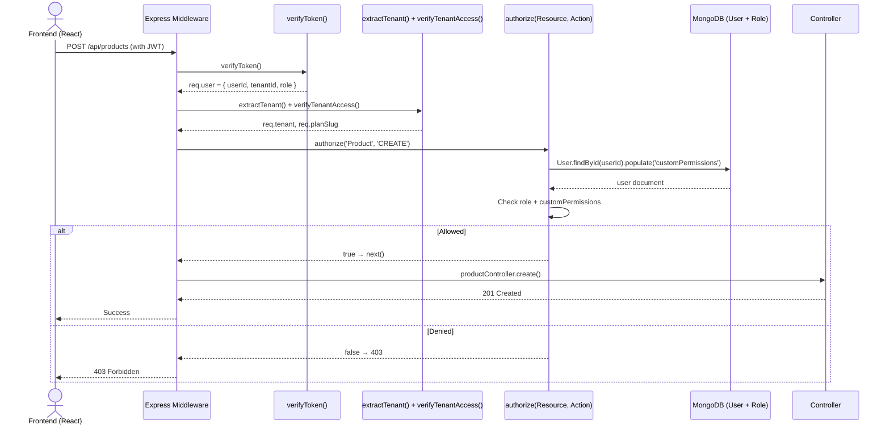

# Authorization Flow (RBAC)

## 📋 Overview

This document details the **Role-Based Access Control (RBAC)** system that governs what each user can do within their tenant.

---

## 🎯 RBAC Design

### **Roles**

| Role | Description | Typical Users |
|------|-------------|---------------|
| **superadmin** | System administrator, cross-tenant access | Platform operators |
| **owner** | Business owner, full control over their tenant | Company founder |
| **manager** | Store/branch manager, can manage most operations | Store manager |
| **accountant** | Financial operations only | Bookkeeper, accountant |
| **staff** | Day-to-day task performer, limited access | Sales clerks, inventory staff |

---

### **Resources (12)**

| Resource | Plural | Examples |
|----------|--------|----------|
| Product | products | Create, edit, delete parts |
| Sale | sales | Create invoices, view all |
| Inventory | inventory | Adjust stock levels |
| Supplier | suppliers | Add/manage suppliers |
| Customer | customers | Add/manage customers |
| Purchase | purchases | Create purchase orders |
| Brand | brands | Create/edit brands |
| Category | categories | Create/edit categories |
| Settings | settings | Business settings |
| Billing | billing | Subscription management |
| Audit | audit | View activity logs |
| User | users | Manage staff accounts |

---

### **Actions**

| Action | Meaning |
|--------|---------|
| CREATE | Create new resource |
| READ | View resource (list or detail) |
| UPDATE | Modify existing resource |
| DELETE | Remove resource |
| VIEW (special) | Read-only for audit logs |

**Note:** Audit resource only has VIEW action (immutable logs).

---

## 🔐 Permission Matrix

### **Standard RBAC Matrix**

| Role ↓ / Action → | Product | Sale | Inventory | Supplier | Customer | Purchase | Brand | Category | Settings | Billing | Audit | User |
|------------------|---------|------|-----------|----------|----------|----------|-------|----------|----------|---------|-------|------|
| **superadmin** | CRUD | CRUD | CRUD | CRUD | CRUD | CRUD | CRUD | CRUD | CRUD | CRUD | VIEW | CRUD |
| **owner** | CRUD | CRUD | CRUD | CRUD | CRUD | CRUD | CRUD | CRUD | CRUD | CRUD | VIEW | CRUD |
| **manager** | CRUD | CRUD | CRUD | CRUD | CRUD | CRUD | CRUD | CRUD | R | R | VIEW | R |
| **accountant** | R | CRUD | R | R | R | R | R | R | R | CRUD | VIEW | R |
| **staff** | R | C | R | R | R | R | R | R | None | None | None | None |

**Legend:**
- **C** = CREATE
- **R** = READ
- **U** = UPDATE
- **D** = DELETE
- **None** = No access

---

### **Special Cases**

**Settings Resource:**
- owner: CRUD (can change business info, billing info, timezone, currency)
- manager: R (view-only)
- accountant: R
- staff: None

**Billing Resource:**
- owner: CRUD (upgrade/downgrade, cancel subscription, view invoices)
- accountant: CRUD (can manage billing)
- manager: R (view only)
- staff: None

**Audit Resource:**
- All roles with access: VIEW (read-only logs)
- Cannot modify (immutable)

**User Resource:**
- owner: CRUD (create/update/delete staff accounts)
- manager: R (view staff list)
- accountant: R
- staff: None

---

## 🔄 Authorization Flow

### **When is Authorization Checked?**

1. **Route-level middleware:** `authorize('Product', 'CREATE')` applied to route
2. **Controller entry:** Or called manually inside controller
3. **Service layer:** Could also check before expensive operations

---

### **Sequence Diagram**



---

## 🧠 PermissionService Implementation

**File:** `BACKEND/src/services/PermissionService.js`

```javascript
const PERMISSIONS = {
  superadmin: {
    Product: ['CREATE', 'READ', 'UPDATE', 'DELETE'],
    Sale: ['CREATE', 'READ', 'UPDATE', 'DELETE'],
    Inventory: ['CREATE', 'READ', 'UPDATE', 'DELETE'],
    Supplier: ['CREATE', 'READ', 'UPDATE', 'DELETE'],
    Customer: ['CREATE', 'READ', 'UPDATE', 'DELETE'],
    Purchase: ['CREATE', 'READ', 'UPDATE', 'DELETE'],
    Brand: ['CREATE', 'READ', 'UPDATE', 'DELETE'],
    Category: ['CREATE', 'READ', 'UPDATE', 'DELETE'],
    Settings: ['CREATE', 'READ', 'UPDATE', 'DELETE'],
    Billing: ['CREATE', 'READ', 'UPDATE', 'DELETE'],
    Audit: ['VIEW'],
    User: ['CREATE', 'READ', 'UPDATE', 'DELETE'],
  },
  owner: {
    Product: ['CREATE', 'READ', 'UPDATE', 'DELETE'],
    Sale: ['CREATE', 'READ', 'UPDATE', 'DELETE'],
    Inventory: ['CREATE', 'READ', 'UPDATE', 'DELETE'],
    Supplier: ['CREATE', 'READ', 'UPDATE', 'DELETE'],
    Customer: ['CREATE', 'READ', 'UPDATE', 'DELETE'],
    Purchase: ['CREATE', 'READ', 'UPDATE', 'DELETE'],
    Brand: ['CREATE', 'READ', 'UPDATE', 'DELETE'],
    Category: ['CREATE', 'READ', 'UPDATE', 'DELETE'],
    Settings: ['CREATE', 'READ', 'UPDATE', 'DELETE'],
    Billing: ['CREATE', 'READ', 'UPDATE', 'DELETE'],
    Audit: ['VIEW'],
    User: ['CREATE', 'READ', 'UPDATE', 'DELETE'],
  },
  manager: {
    Product: ['CREATE', 'READ', 'UPDATE', 'DELETE'],
    Sale: ['CREATE', 'READ', 'UPDATE', 'DELETE'],
    Inventory: ['CREATE', 'READ', 'UPDATE', 'DELETE'],
    Supplier: ['CREATE', 'READ', 'UPDATE', 'DELETE'],
    Customer: ['CREATE', 'READ', 'UPDATE', 'DELETE'],
    Purchase: ['CREATE', 'READ', 'UPDATE', 'DELETE'],
    Brand: ['CREATE', 'READ', 'UPDATE', 'DELETE'],
    Category: ['CREATE', 'READ', 'UPDATE', 'DELETE'],
    Settings: ['READ'],  // Cannot edit settings
    Billing: ['READ'],   // Cannot change subscription
    Audit: ['VIEW'],
    User: ['READ'],      // Can view staff, not modify
  },
  accountant: {
    Product: ['READ'],
    Sale: ['CREATE', 'READ', 'UPDATE'],  // Can create invoices, but not delete
    Inventory: ['READ'],
    Supplier: ['READ'],
    Customer: ['READ'],
    Purchase: ['READ'],
    Brand: ['READ'],
    Category: ['READ'],
    Settings: ['READ'],
    Billing: ['CREATE', 'READ', 'UPDATE', 'DELETE'],  // Full billing access
    Audit: ['VIEW'],
    User: ['READ'],
  },
  staff: {
    Product: ['READ'],
    Sale: ['CREATE', 'READ'],  // Can create sales, view own
    Inventory: ['READ'],
    Supplier: ['READ'],
    Customer: ['CREATE', 'READ'],  // Can add customers
    Purchase: ['READ'],
    Brand: ['READ'],
    Category: ['READ'],
    Settings: [],
    Billing: [],
    Audit: [],
    User: [],
  },
};

exports.checkPermission = (role, resource, action, customPermissions = []) => {
  // Superadmin has implicit access to everything
  if (role === 'superadmin') {
    return true;
  }

  // Get standard permissions for role
  const rolePermissions = PERMISSIONS[role];
  if (!rolePermissions) {
    return false;
  }

  const allowedActions = rolePermissions[resource] || [];
  const hasStandardPermission = allowedActions.includes(action);

  // Custom permissions override (grants additional access)
  const customPermissionKey = `${resource}:${action}`;
  const hasCustomPermission = customPermissions.includes(customPermissionKey) ||
                               customPermissions.includes('*');  // Wildcard

  return hasStandardPermission || hasCustomPermission;
};
```

---

## 🛡️ Middleware Implementation

**File:** `BACKEND/src/middleware/permissionMiddleware.js`

```javascript
const PermissionService = require('../services/PermissionService');

exports.authorize = (resource, action) => {
  return async (req, res, next) => {
    const userId = req.user.userId;
    const tenantId = req.tenantId;

    try {
      // Load user with custom permissions
      const user = await User.findById(userId).select('role customPermissions');
      if (!user) {
        return res.status(404).json({ message: 'User not found' });
      }

      // Check if user belongs to this tenant (multi-tenancy)
      if (user.tenantId.toString() !== tenantId.toString() && user.role !== 'superadmin') {
        return res.status(403).json({ message: 'Access denied' });
      }

      // Check permission
      const allowed = await PermissionService.checkPermission(
        user.role,
        resource,
        action,
        user.customPermissions || []
      );

      if (!allowed) {
        // Log failed attempt
        await ActivityLogger.log(
          userId,
          'AUTHORIZATION_FAILED',
          resource,
          null,
          { resource, action, role: user.role },
          {}
        );

        return res.status(403).json({
          message: `Insufficient permissions. Role '${user.role}' cannot ${action} ${resource}.`,
          requiredRole: 'owner/manager/accountant/staff',
          yourRole: user.role,
        });
      }

      // Attach user to request for controller use
      req.userRole = user.role;
      req.userPermissions = user.customPermissions;

      next();
    } catch (err) {
      console.error('Authorization error:', err);
      return res.status(500).json({ message: 'Authorization check failed' });
    }
  };
};
```

---

## 📝 Route Protection Examples

### **Example 1: Product CRUD**

**Routes file:** `BACKEND/src/routes/productRoutes.js`

```javascript
const express = require('express');
const router = express.Router();
const productController = require('../controllers/productController');
const { authorize } = require('../middleware/permissionMiddleware');
const { verifyToken, extractTenant, verifyTenantAccess, rateLimitTenant, recordUsage, checkUsageAndWarn } = require('../middleware');

const protectedStack = [
  verifyToken,
  extractTenant,
  verifyTenantAccess,
  rateLimitTenant(),
  recordUsage,
  checkUsageAndWarn,
];

// GET /api/products - READ list (all roles can read)
router.get('/', protectedStack, productController.list);

// GET /api/products/:id - READ single
router.get('/:id', protectedStack, productController.get);

// POST /api/products - CREATE (owner, manager, accountant can create)
router.post('/', protectedStack, authorize('Product', 'CREATE'), productController.create);

// PUT /api/products/:id - UPDATE (owner, manager)
router.put('/:id', protectedStack, authorize('Product', 'UPDATE'), productController.update);

// DELETE /api/products/:id - DELETE (owner, manager)
router.delete('/:id', protectedStack, authorize('Product', 'DELETE'), productController.remove);

module.exports = router;
```

---

### **Example 2: Sales (Invoices)**

```javascript
// All roles can READ sales
router.get('/', protectedStack, productController.list);

// Staff can CREATE sales (point of sale)
router.post('/', protectedStack, authorize('Sale', 'CREATE'), saleController.create);

// Only owner/manager/accountant can UPDATE (edit invoice)
router.put('/:id', protectedStack, authorize('Sale', 'UPDATE'), saleController.update);

// Only owner/manager can DELETE (void invoice)
router.delete('/:id', protectedStack, authorize('Sale', 'DELETE'), saleController.remove);
```

---

### **Example 3: Audit Logs (VIEW only)**

```javascript
router.get(
  '/logs',
  protectedStack,
  authorize('Audit', 'VIEW'),
  auditController.getLogs
);

// No CREATE/UPDATE/DELETE routes for Audit (immutable)
```

---

### **Example 4: Billing (Subscription Management)**

```javascript
// All can READ subscription status
router.get('/subscription', protectedStack, billingController.getSubscription);

// Only owner/accountant can change plan (upgrade/downgrade)
router.post('/change-plan', protectedStack, authorize('Billing', 'UPDATE'), billingController.changePlan);

// Only owner/accountant can cancel
router.delete('/subscription', protectedStack, authorize('Billing', 'DELETE'), billingController.cancel);

// Only owner/accountant can view invoices
router.get('/invoices', protectedStack, authorize('Billing', 'READ'), billingController.listInvoices);
```

---

## 🎯 Custom Permissions

**Override mechanism:** Admins can grant specific permissions to users beyond their role.

**Example:** Staff member needs to update products occasionally.

**In Settings → Users → Edit User:**
```
Role: staff
Custom Permissions:
  [x] Product:UPDATE
  [ ] Product:DELETE
  [ ] Sale:DELETE
```

**Stored in User model:**
```json
{
  "role": "staff",
  "customPermissions": [
    "Product:UPDATE",
    "Product:CREATE"
  ]
}
```

**Check:**
```javascript
const allowed = await checkPermission(user.role, 'Product', 'UPDATE', user.customPermissions);
// Returns true because customPermissions includes "Product:UPDATE"
```

**Wildcard:**
```json
{
  "customPermissions": ["*"]  // Grants all permissions
}
```

---

## 🔍 Debugging Authorization Issues

### **Scenario: Staff user gets 403 on Product UPDATE**

**Step 1: Check user role & permissions**
```bash
# In MongoDB
db.users.find({ email: "staff@acmebikes.com" }).pretty()
```
```json
{
  "_id": "...",
  "tenantId": "...",
  "role": "staff",
  "customPermissions": []
}
```

**Step 2: Check what's allowed**
```javascript
// In Node REPL or controller
const allowed = PermissionService.checkPermission('staff', 'Product', 'UPDATE', []);
console.log(allowed);  // false
```

**Why?** Staff role only has READ + CREATE on Product, not UPDATE.

**Fix:** Either:
- Change role to `accountant` (has UPDATE on Product? No, accountant only READ)
- Change role to `manager` (has UPDATE)
- Add custom permission `Product:UPDATE` to user

---

### **Scenario: Manager can't access Settings**

```javascript
PermissionService.checkPermission('manager', 'Settings', 'READ', []);
// Returns false?
```

**Check matrix:** Manager has `Settings: ['READ']` → returns `true`.

**If false:** Check customPermissions overriding? No, customPermissions only adds, doesn't subtract.

**Actual cause:** Manager was accidentally given `Settings: []` in matrix (bug in PERMISSIONS object). Fix: Add `'READ'` to manager Settings.

---

### **Scenario: Owner can't view Audit logs?**

**Check:** Owner should have `Audit: ['VIEW']` → returns `true`.

If missing: Matrix incomplete. Add `'VIEW'` to owner Audit permissions.

---

## 📊 Permission Testing Matrix

### **Test Plan**

For each role, test each resource+action:

```javascript
const testCases = [
  // Product
  { role: 'owner', resource: 'Product', action: 'CREATE', expected: true },
  { role: 'staff', resource: 'Product', action: 'CREATE', expected: true },
  { role: 'staff', resource: 'Product', action: 'UPDATE', expected: false },
  { role: 'staff', resource: 'Product', action: 'DELETE', expected: false },

  // Settings
  { role: 'manager', resource: 'Settings', action: 'READ', expected: true },
  { role: 'manager', resource: 'Settings', action: 'UPDATE', expected: false },
  { role: 'staff', resource: 'Settings', action: 'READ', expected: false },

  // Audit
  { role: 'accountant', resource: 'Audit', action: 'VIEW', expected: true },
  { role: 'staff', resource: 'Audit', action: 'VIEW', expected: false },

  // Billing
  { role: 'accountant', resource: 'Billing', action: 'UPDATE', expected: true },
  { role: 'staff', resource: 'Billing', action: 'READ', expected: false },

  // Custom permission override
  { role: 'staff', resource: 'Product', action: 'UPDATE', customPermissions: ['Product:UPDATE'], expected: true },
];

testCases.forEach(({ role, resource, action, customPermissions = [], expected }) => {
  const result = PermissionService.checkPermission(role, resource, action, customPermissions);
  console.assert(result === expected, `FAIL: ${role} ${resource} ${action} → expected ${expected}, got ${result}`);
});
```

---

## 🔄 Authorization in Controllers (Manual)

Sometimes authorization is done inside controller (less ideal but sometimes needed):

```javascript
exports.delete = async (req, res) => {
  const productId = req.params.id;
  const tenantId = req.tenantId;

  // Manual check
  const user = await User.findById(req.user.userId);
  const allowed = PermissionService.checkPermission(user.role, 'Product', 'DELETE', user.customPermissions);

  if (!allowed) {
    return res.status(403).json({ message: 'Cannot delete products' });
  }

  // Proceed
  const product = await Product.findOneAndDelete({ _id: productId, tenantId });
  res.json({ message: 'Deleted' });
};
```

**Better:** Use route-level `authorize()` middleware to keep controller clean.

---

## 📈 Dynamic Permissions (Future)

**Current:** Static PERMISSIONS object in PermissionService

**Future considerations:**

1. **Tenant-defined roles**
   - Owner creates custom role "Warehouse Manager"
   - Assigns granular permissions via UI
   - Stored in database: `Role` collection

2. **Resource-level permissions**
   - User A can only edit products in "Category: Brakes"
   - Attribute-based access control (ABAC)

3. **Time-based permissions**
   - Staff can only make sales during business hours
   - Accountant can only access reports during month-end

4. **Context-aware permissions**
   - Can UPDATE Product only if `product.status === 'draft'`
   - Can DELETE Sale only if `sale.status === 'pending'`

---

## 🧪 Authorization Test Examples

### **API Tests with cURL**

```bash
# 1. Login as staff
TOKEN=$(curl -X POST http://localhost:4000/api/auth/login \
  -d '{"email":"staff@test.com","password":"pass"}' | jq -r '.token')

# 2. Try CREATE Product (should work - staff can CREATE)
curl -X POST http://localhost:4000/api/products \
  -H "Authorization: Bearer $TOKEN" \
  -H "Content-Type: application/json" \
  -d '{"name":"Test","brandId":"...","categoryId":"...","price":10}'
# Expected: 201

# 3. Try DELETE Product (should fail - staff cannot DELETE)
curl -X DELETE http://localhost:4000/api/products/{id} \
  -H "Authorization: Bearer $TOKEN"
# Expected: 403

# 4. Login as manager
TOKEN_MGR=$(curl -X POST ... | jq -r '.token')

# 5. DELETE Product as manager (should work)
curl -X DELETE ... -H "Authorization: Bearer $TOKEN_MGR"
# Expected: 200
```

---

## 🐛 Common Issues

### **Issue: All users get 403 even for allowed actions**

**Cause:** Middleware not applied to route, or `authorize()` called with wrong resource/action

**Check:**
```javascript
// In productRoutes.js
router.post('/', protectedStack, authorize('Product', 'CREATE'), productController.create);
//                                   ^^^^^^^^^^^^^^^^ resource
//                                               ^^^^^^^ action
```

**Fix:** Match exactly the keys in PERMISSIONS object (case-sensitive).

---

### **Issue: Custom permissions not working**

**Cause:** Custom permissions not loaded from database

**Check:**
```javascript
// User document
{
  "role": "staff",
  "customPermissions": ["Product:UPDATE"]  // This needs to be populated
}
```

**Fix:** Ensure User query includes `customPermissions` field.

---

### **Issue: Superadmin bypass not working**

**Cause:** `authorize()` middleware runs before `verifyToken`? Or `extractTenant` fails?

**Check order:**
```
verifyToken → extractTenant → authorize()
```

Superadmin still has tenantId? Actually `verifyToken` allows superadmin:
```javascript
if (decoded.role === 'superadmin') {
  req.user = decoded;
  return next();  // skips tenantId requirement
}
```

**So superadmin should bypass `extractTenant` and `verifyTenantAccess` too.**

**But if superadmin route goes through same protected stack:**
```javascript
app.use('/api/products', protectedStack, productRoutes);
// protectedStack includes verifyToken, extractTenant, verifyTenantAccess...
```

`verifyTenantAccess` for superadmin:
```javascript
if (!req.user.tenantId && req.user.role === 'superadmin') {
  // Superadmin doesn't need tenantId
  next();
}
```

**Check:** `tenantMiddleware.js` should handle superadmin case.

---

## 📊 Performance

| Operation | Cost |
|-----------|------|
| Load user (including customPermissions) | ~5ms (indexed by _id) |
| Check permission (in-memory lookup) | <1ms |
| Total per-request authorization overhead | ~5-10ms |

**Optimization:**
- Cache user permissions in Redis (userId → {role, customPermissions}) with 5min TTL
- Reduces DB load from 1 query to 0 for subsequent requests

**Implementation:**
```javascript
exports.authorize = async (req, res, next) => {
  const userId = req.user.userId;
  const cacheKey = `user_perms:${userId}`;

  let cached = await redis.get(cacheKey);
  if (cached) {
    const user = JSON.parse(cached);
    // check permission...
  }

  const user = await User.findById(userId).select('role customPermissions');
  await redis.setex(cacheKey, 300, JSON.stringify(user));
  // check permission...
};
```

---

## 🔐 Security Considerations

1. **Never trust client-provided role** - Always load from DB
2. **Check tenantId** - Ensure user belongs to tenant (except superadmin)
3. **Log authorization failures** - Detect attack patterns
4. **Apply to ALL routes** - Forgetting `authorize()` on a route creates security hole
5. **Least privilege** - Staff gets minimum permissions needed
6. **Custom permissions override** - Allows flexibility without compromising default deny

---

## 📚 Related Documents

- [02-request-flow.md](02-request-flow.md) - Authorization in middleware chain
- [06-multi-tenancy-flow.md](06-multi-tenancy-flow.md) - Tenant isolation + authorization
- [User Model Documentation](../BACKEND/src/models/User.js) - customPermissions field
- [PermissionService](../BACKEND/src/services/PermissionService.js) - Core logic

---

**Next:** [06-multi-tenancy-flow.md](06-multi-tenancy-flow.md) - Data isolation patterns
