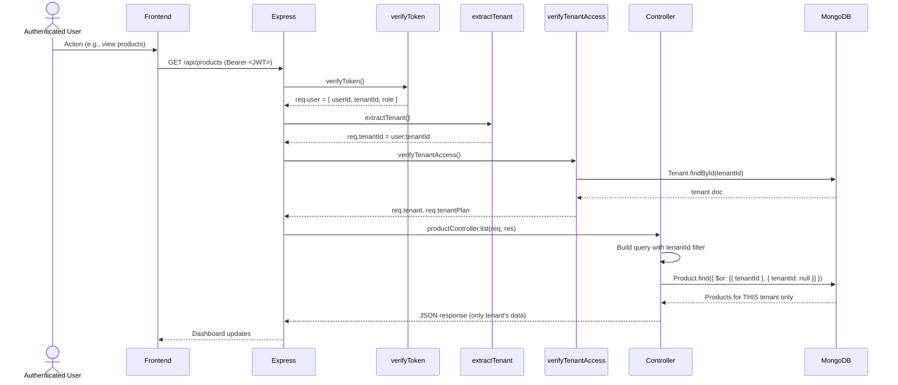

# Multi-Tenancy & Data Isolation Flow

## 📋 Overview

This document explains how the BikeFlow platform achieves **secure multi-tenancy** - the ability to serve multiple businesses (tenants) from a single shared database and application instance while ensuring complete data isolation.

---

## 🏗️ Multi-Tenancy Strategy

### **Approach: Shared Database + TenantId**

All tenants share the same MongoDB database and collections. Every document includes a `tenantId` field that scopes data to a specific tenant.

**Benefits:**
- ✅ Lower infrastructure cost (one database cluster)
- ✅ Easy tenant management (single connection string)
- ✅ Simple backups/restores (one dump, but filter by tenantId)
- ✅ Good performance for <10,000 tenants (with proper indexing)
- ✅ Easy to add new tenant (no schema changes)

**Drawbacks:**
- ⚠️ Single point of failure (database down affects all tenants)
- ⚠️ Harder to achieve tenant-level encryption (all data in same collection)
- ⚠️ Cannot easily move tenant to different cluster (must export/import)
- ⚠️ Potential for tenantId leakage bugs (catastrophic if bug)

**When to switch to DB-per-tenant?** >1,000 tenants or enterprise requirements.

---

## 🔐 The TenantId Invariant

**Golden Rule:**
> Every query that accesses tenant-specific data MUST include a `tenantId` filter.

**Violation = Data leak between tenants = Critical security bug**

---

## 📊 Data Model: Tenant vs Global

### **Tenant-Specific Collections** (most data)

These collections have `tenantId` field and all queries filter by it:

- **User** - `{ tenantId, email, name, role, ... }`
- **Product** - `{ tenantId, name, sku, price, ... }` (plus global products with `tenantId: null`)
- **Sale** - `{ tenantId, customer, items[], total, ... }`
- **Purchase** - `{ tenantId, supplier, items[], ... }`
- **Inventory** - `{ tenantId, productId, quantity, ... }`
- **Supplier** - `{ tenantId, name, contact, ... }`
- **Customer** - `{ tenantId, name, email, ... }`
- **TenantPlan** - `{ tenantId, planId, status, ... }`
- **Invoice** - `{ tenantId, invoiceNumber, amount, ... }`
- **AuditLog** - `{ tenantId, userId, action, ... }`

---

### **Global (Shared) Collections**

These collections can have `tenantId: null` and are visible to all tenants:

- **Brand** - `{ tenantId: null OR tenantId }`
  - Admin creates global brands (e.g., "Honda", "Yamaha") with `tenantId: null`
  - Tenant can also create custom brands with their `tenantId`
- **Category** - `{ tenantId: null OR tenantId }`
  - Global: "Engine Parts", "Brakes", "Suspension"
  - Tenant-specific: custom categories

**Special:** These use `$or: [{ tenantId }, { tenantId: null }]` queries to show both.

---

### **System Collections** (no tenantId)

- **Plan** - `{ slug, name, price, limits }` (catalog, same for all)
- **PlatformSettings** - Global system config

---

## 🔄 Request Flow with Tenant Context



**Critical:** Even if user manipulates JWT to change `tenantId`, `extractTenant` overwrites with value from decoded token. Cannot inject different tenantId via request body.

---

## 🛡️ Tenant Isolation Implementation

### **1. Middleware Chain**

**Order (from `app.js`):**
```
IP Rate Limit
  ↓
verifyToken (JWT)
  ↓
extractTenant (req.tenantId = user.tenantId)
  ↓
verifyTenantAccess (load Tenant doc, check status)
  ↓
rateLimitTenant (using req.tenantId)
  ↓
recordUsage (increment tenant usage)
  ↓
authorize (check user.role + tenantId match)
  ↓
Controller
```

**Key Middleware Code:**

**`extractTenant`** (`tenantMiddleware.js`):
```javascript
exports.extractTenant = (req, res, next) => {
  if (!req.user || !req.user.tenantId) {
    return res.status(403).json({
      message: 'Tenant ID not found in token'
    });
  }
  req.tenantId = req.user.tenantId;  // Trust JWT, not request body
  req.userId = req.user.userId || req.user.id;
  next();
};
```

**Why extract from JWT?** Because JWT is signed and verified in `verifyToken`. Cannot tamper with `tenantId` claim.

---

### **2. Query Pattern: The Tenant Filter**

**Never do this:**
```javascript
// ❌ BAD - No tenantId filter!
const products = await Product.find({ name: 'Brake Pads' });
```

**Always do this:**
```javascript
// ✅ GOOD - Tenant-scoped
const tenantId = req.tenantId;
const products = await Product.find({
  $or: [
    { tenantId },           // Tenant's own products
    { tenantId: null }     // Global shared products (brands/categories)
  ]
});
```

**Helper Function (in controllers):**
```javascript
const buildTenantFilter = (tenantId, extra = {}) => {
  return {
    ...extra,
    $or: [{ tenantId }, { tenantId: null }]
  };
};

// Usage:
const filter = buildTenantFilter(req.tenantId, { category: 'Brakes' });
const products = await Product.find(filter);
```

---

### **3. Controllers Must Use req.tenantId**

**Example: `productController.js:list`**

```javascript
exports.list = async (req, res) => {
  const tenantId = req.tenantId;  // From middleware, NEVER from req.body
  const filter = buildTenantFilter(tenantId, {});

  if (req.query.q) {
    filter.$and = [
      buildTenantFilter(tenantId),
      { $or: [{ name: regex }, { sku: regex }, { brand: regex }] }
    ];
  }

  const items = await Product.find(filter)
    .populate('brandId categoryId')
    .skip(skip)
    .limit(limit);

  res.json({ items, page, total });
};
```

---

### **4. Populating References with Tenant Scope**

**Problem:** Brand and Category can be global (`tenantId: null`) or tenant-specific.

**Solution:** `populate()` with tenant filter:

```javascript
const PRODUCT_POPULATE = [
  { path: 'brandId', select: 'name', match: { $or: [{ tenantId }, { tenantId: null }] } },
  { path: 'categoryId', select: 'name', match: { $or: [{ tenantId }, { tenantId: null }] } }
];

const products = await Product.find(filter)
  .populate(PRODUCT_POPULATE)
  .exec();
```

**Note:** `match` option in populate ensures only tenant-scoped or global brands/categories are populated.

---

## 🧪 Testing Tenant Isolation

### **Test 1: Tenant A cannot see Tenant B's data**

```bash
# Create Tenant A
curl -X POST /api/auth/signup -d '{...tenantName:"Tenant A"..., email:"a@test.com"}'
TOKEN_A=eyJ...

# Create product as Tenant A
curl -X POST /api/products -H "Authorization: Bearer $TOKEN_A" \
  -d '{"name":"A-Product", ...}'
# Product tenantId = Tenant A's ID

# Create Tenant B
curl -X POST /api/auth/signup -d '{...tenantName:"Tenant B"..., email:"b@test.com"}'
TOKEN_B=eyJ...

# Tenant B tries to list products
curl -H "Authorization: Bearer $TOKEN_B" /api/products
# Should NOT see "A-Product" in list

# Verify with DB
db.products.find({ tenantId: TenantA_ID })  // Finds A-Product
db.products.find({ tenantId: TenantB_ID })  // Does NOT find A-Product
```

---

### **Test 2: Global brands visible to all tenants**

```bash
# Create global brand (admin only, tenantId: null)
db.brands.insertOne({
  _id: ObjectId("..."),
  name: "Honda",
  tenantId: null  // Global
});

# Tenant A's product list shows Honda
curl -H "Authorization: Bearer $TOKEN_A" /api/products
# → brandId populated with Honda

# Tenant B's product list shows Honda
curl -H "Authorization: Bearer $TOKEN_B" /api/products
# → brandId populated with Honda
```

**But:** Tenant A cannot DELETE global brand (RBAC prevents, plus brandId check in controller)

```javascript
// In brandController.delete
const brand = await Brand.findOne({
  _id: req.params.id,
  $or: [{ tenantId: req.tenantId }, { tenantId: null }]
});

if (!brand) return 404;

// Prevent deletion of global brands (tenantId: null)
if (brand.tenantId === null && req.userRole !== 'superadmin') {
  return res.status(403).json({ message: 'Cannot delete global brand' });
}
```

---

### **Test 3: Query without tenant filter returns empty**

```javascript
// Simulate buggy controller that forgets tenantId
exports.list_BAD = async (req, res) => {
  const products = await Product.find({});  // ❌ No filter!
  res.json(products);
};

// Result: Tenant A sees ALL tenants' products = CRITICAL BUG!
```

**Mitigation:** Code review checklist: "All queries include tenantId?"

---

## 🔍 Debugging Tenant Isolation Issues

### **Issue: User sees other tenant's data**

**Investigation steps:**

1. Check JWT payload: `jwt.decode(token)` → does `tenantId` match expected tenant?
2. Check middleware: Did `extractTenant` set `req.tenantId` correctly? Add `console.log(req.tenantId)` in controller.
3. Check query: Did controller use `req.tenantId` or `req.body.tenantId`?
4. Check DB: `db.products.find({ tenantId: { $ne: expectedTenantId } })` → any documents without tenantId or wrong tenantId?

**Common causes:**
- Controller uses `req.body.tenantId` (user can inject any value)
- Query missing `tenantId` filter entirely
- `buildTenantFilter` used incorrectly (e.g., `buildTenantFilter(null)`)

---

### **Issue: Global products not showing up**

**Cause:** Query used `{ tenantId }` instead of `$or`:

```javascript
// ❌ Wrong - only shows tenant-specific
Product.find({ tenantId });

// ✅ Correct - shows tenant + global
Product.find({ $or: [{ tenantId }, { tenantId: null }] });
```

**Fix:** Always use `buildTenantFilter()` helper.

---

## 📊 Indexing Strategy

**Tenant-scoped queries need compound indexes:**

```javascript
// Product model
productSchema.index({ tenantId: 1, name: 1 });           // Search by name within tenant
productSchema.index({ tenantId: 1, sku: 1, tenantId: 1, barcode: 1 }); // Unique identifiers
productSchema.index({ tenantId: 1, createdAt: -1 });    // Recent products

// Brand/Category
brandSchema.index({ tenantId: 1, name: 1 });

// Sale
saleSchema.index({ tenantId: 1, createdAt: -1 });
saleSchema.index({ tenantId: 1, status: 1 });

// AuditLog
auditLogSchema.index({ tenantId: 1, createdAt: -1 });  // Tenant's audit trail
```

**Why compound with `tenantId`?**
- MongoDB can use index to both filter tenant AND sort/filter by other field
- Without `tenantId` prefix, MongoDB would scan entire collection then filter (slow with many tenants)

---

## 🔄 Tenant Creation Flow (from Signup)

**See [03-registration-flow.md](03-registration-flow.md) for full details.**

**Key point:** Tenant document is created first with unique `email` and generated `_id`.

Then User document references that Tenant via `tenantId`.

Then TenantPlan references Tenant via `tenantId`.

All subsequently created data (products, sales, etc.) use `tenantId` from authenticated user's JWT.

---

## 🔐 Security Boundaries

### **Tenant Isolation Enforcement Points**

| Layer | Enforcement | Code Location |
|-------|-------------|---------------|
| **Authentication** | JWT contains tenantId from DB (cannot forge) | `authController.login` |
| **Middleware** | `extractTenant` sets `req.tenantId` from verified JWT | `tenantMiddleware.js` |
| **Query Building** | All queries must include `tenantId` filter | Controllers + helper |
| **Population** | `match` option in `populate()` enforces tenant scope | Controller queries |
| **RBAC** | Users cannot access other tenants' resources | `permissionMiddleware.js` |
| **Deletion** | Delete queries include `tenantId` | All `findOneAndDelete` calls |

---

### **What about Superadmin?**

Superadmin role bypasses tenant isolation intentionally:

```javascript
// In verifyTenantAccess middleware:
if (req.user.role === 'superadmin') {
  // Superadmin doesn't need tenantId in JWT
  // They can access any tenant
  next();
}
```

**Superadmin routes** (`/api/admin/*`) don't go through `extractTenant` or `verifyTenantAccess` at all - they have separate route group.

---

## 🧠 Data Migration Between Tenants (Future)

**Scenario:** Customer wants to export data and import to new tenant.

**Export (per tenant):**
```bash
# MongoDB export with filter
mongoexport --db aicoding --collection products \
  --query '{"tenantId": "65f4a3b8e4b0123456789xyz"}' \
  --out tenant-a-products.json

mongoexport --db aicoding --collection sales \
  --query '{"tenantId": "65f4a3b8e4b0123456789xyz"}' \
  --out tenant-a-sales.json

# ... all tenant-scoped collections
```

**Import:**
```bash
# Import into new tenant (after signup)
mongoimport --db aicoding --collection products --file tenant-a-products.json --jsonArray
# But need to replace old tenantId with new tenantId in JSON first!
```

**Tooling needed:** Migration script that:
1. Exports all tenant-scoped data (excluding AuditLog, ActivityLog, sessions)
2. Replaces `tenantId` references in JSON
3. Imports to new tenant
4. Verifies data integrity

**Caution:** Global brands/categories (`tenantId: null`) should NOT be duplicated - they're already global.

---

## 🐛 Common Bugs & Prevention

### **Bug 1: Missing tenantId filter**

**Code:**
```javascript
exports.list = async (req, res) => {
  const items = await Product.find({});  // ❌
  res.json(items);
};
```

**Result:** All tenants' products returned to user = Data leak

**Prevention:**
- **Static analysis:** ESLint rule to enforce `tenantId` in all queries
- **Code review:** Checklist item "tenantId filter present?"
- **Test:** Automated test that queries as Tenant A and asserts no Tenant B data

---

### **Bug 2: Using req.body.tenantId**

**Code:**
```javascript
exports.create = async (req, res) => {
  const payload = { ...req.body };
  // Client sent tenantId in body!
  const tenantId = payload.tenantId;  // ❌

  const product = new Product({ ...payload, tenantId });
  await product.save();
};
```

**Exploit:** Malicious client sends `{"tenantId": "OTHER_TENANT_ID"}` → product created in other tenant's space!

**Fix:**
```javascript
exports.create = async (req, res) => {
  const payload = { ...req.body };
  delete payload.tenantId;  // Strip any client-provided tenantId
  const tenantId = req.tenantId;  // ✅ From verified JWT

  const product = new Product({ ...payload, tenantId });
  await product.save();
};
```

**Pattern:** Always `delete req.body.tenantId` at start of controller (or use destructuring to exclude it).

---

### **Bug 3: Populate without match filter**

**Code:**
```javascript
const products = await Product.find({ tenantId })
  .populate('brandId')  // ❌ No match!
  .exec();
```

**Result:** If product references brand from different tenant (shouldn't happen, but if it does), populate would fetch it anyway (cross-tenant data leak).

**Fix:**
```javascript
.populate({
  path: 'brandId',
  match: { $or: [{ tenantId }, { tenantId: null }] }  // ✅
})
```

---

### **Bug 4: Global data modification by tenant**

**Scenario:** Tenant modifies global brand

```javascript
exports.updateBrand = async (req, res) => {
  const brand = await Brand.findById(req.params.id);
  // If brand.tenantId === null (global), tenant should NOT edit!
  if (brand.tenantId === null && req.user.role !== 'superadmin') {
    return res.status(403).json({ message: 'Cannot modify global brand' });
  }
  // ...
};
```

---

### **Bug 5: Cross-tenant search**

**Problem:** Full-text search across all tenants accidentally implemented:

```javascript
// ❌ BAD - global product search (allows tenant to see others)
router.get('/search-all', productController.searchAll);

exports.searchAll = async (req, res) => {
  const q = req.query.q;
  const products = await Product.find({ name: { $regex: q } });  // No tenant filter!
  res.json(products);
};
```

**Fix:** Ensure ALL product endpoints use tenant filter:

```javascript
exports.search = async (req, res) => {
  const tenantId = req.tenantId;
  const q = req.query.q;
  const filter = buildTenantFilter(tenantId, {
    $or: [{ name: regex }, { sku: regex }, { brand: regex }]
  });
  const products = await Product.find(filter);
  res.json(products);
};
```

---

## 🛠️ Tools for Tenant Isolation Testing

### **Automated Test: Multi-Tenant Isolation**

```javascript
// tests/multi-tenancy.test.js
describe('Multi-Tenancy Isolation', () => {
  let tokenA, tokenB, productId;

  test('Tenant A creates product', async () => {
    const res = await request(app)
      .post('/api/products')
      .set('Authorization', `Bearer ${tokenA}`)
      .send({ name: 'Tenant-A-Product', ... });
    expect(res.status).toBe(201);
    productId = res.body.id;
  });

  test('Tenant B cannot see Tenant A product', async () => {
    const res = await request(app)
      .get(`/api/products/${productId}`)
      .set('Authorization', `Bearer ${tokenB}`);
    expect(res.status).toBe(404);  // Not found (tenant isolation)
  });

  test('Tenant A can see own product', async () => {
    const res = await request(app)
      .get(`/api/products/${productId}`)
      .set('Authorization', `Bearer ${tokenA}`);
    expect(res.status).toBe(200);
    expect(res.body.name).toBe('Tenant-A-Product');
  });
});
```

---

## 📈 Scaling Multi-Tenancy

### **Read Scaling**

**Problem:** Single MongoDB cluster with N tenants. All queries hit same primary.

**Solution 1: Read Replicas**
```javascript
// Configure Mongoose to use readPreference
mongoose.connect(uri, {
  readPreference: 'secondaryPreferred',  // Read from replica if available
});
```

**Caveat:** Replica lag → user might not see recent writes (their own). Need to read from primary for writes, allow eventual consistency for analytics/reports.

**Solution 2: Caching Layer (Redis)**
- Cache frequently accessed data (products, categories) per tenant
- Invalidate on update
- Use key pattern: `cache:products:{tenantId}:{page}:{limit}:{query}`

---

### **Write Scaling**

**Problem:** MongoDB primary can handle limited writes/sec (~1k-10k depending on hardware)

**With 1,000 tenants each making 10 writes/min → ~167 writes/sec total (manageable)**

**With 10,000 tenants each making 10 writes/min → ~1,667 writes/sec (still OK with properly indexed queries)**

**With 100,000 tenants → ~17k writes/sec → need sharding**

---

### **Sharding (Future, >100k tenants)**

**Shard key:** `{ tenantId: 1, _id: 1 }`

- Each tenant's data lives on same shard (co-location)
- All queries with `tenantId` filter can be routed to single shard (targeted query)
- Even distribution across shards (different tenants on different shards)

**Challenge:** Global collections (`Brand`, `Category`, `Plan`) cannot be sharded by `tenantId` (since `tenantId: null`). Must be on every shard (duplicated) or separate unsharded collection.

---

### **Moving Tenant to Different Cluster (Tenant Migration)**

**Use case:** Enterprise customer wants dedicated database.

**Migration process:**

1. **Export:** `mongoexport` all documents with `tenantId: X`
2. **Transform:** Replace `tenantId` with new ID if necessary
3. **Import:** `mongoimport` to new cluster
4. **Update:** Tenant's JWT configuration points to new cluster? Actually JWT doesn't encode DB location.
5. **Switchover:** Update application routing (feature flag per tenant)
   - Multi-tenant app: Tenant A → Cluster 1, Tenant B → Cluster 2
   - Need middleware to route by tenantId
   - Or different app instances per cluster

**Complexity:** High. Better to delay until strong business need (>$50k/tenant/year justifies dedicated infra).

---

## 🔐 Testing Data Leaks

### **Penetration Test Checklist**

- [ ] Authenticate as Tenant A
- [ ] Enumerate all API endpoints
- [ ] For each endpoint, try to access data by:
  - Changing `tenantId` in URL (if present)
  - Missing `Authorization` header (should 401)
  - Invalid JWT (should 401)
  - Valid JWT but for different tenant (isolation should prevent)
- [ ] Try to access global brands as tenant without proper role? (RBAC)
- [ ] Try to modify `tenantId` in request body (stripped by middleware?)
- [ ] Check server logs for SQL/NoSQL injection attempts

---

## 📊 Tenant Isolation in Other Layers

### **File Storage**

**Current:** `uploads/` directory stores files (product images, PDFs)

**Problem:** If filenames are predictable (`/uploads/product-123.jpg`), Tenant A could fetch Tenant B's files.

**Solution:**
- Store files with UUID names (`abc123-def456.jpg`)
- Metadata in DB links file to `tenantId` + `productId`
- Serve via authenticated endpoint:
  ```javascript
  router.get('/uploads/:filename', verifyToken, async (req, res) => {
    const file = await FileMetadata.findOne({ filename: req.params.filename, tenantId: req.tenantId });
    if (!file) return 404;
    res.sendFile(path.join(__dirname, '..', 'uploads', file.filename));
  });
  ```
- Or use AWS S3 with tenant-prefixed paths (`tenant-a/product-123.jpg`) + signed URLs

---

### **Redis Keys**

**Namespacing:** Prefix all keys with `tenantId` to avoid collision if multiple tenants share Redis instance (not applicable in shared DB setup, but good practice):

```javascript
const key = `tenant:${tenantId}:rate_limit`;
await redis.incr(key);
```

**Current implementation:** Uses `rate_limit:{tenantId}` and `usage:{tenantId}` - good separation.

---

### **Background Jobs**

**If job processes tenant data, ensure job includes tenantId in payload:**

```javascript
// BullMQ job example
await queue.add('generate-invoice-pdf', {
  tenantId: tenant._id,
  invoiceId: invoice._id,
  userId: user._id,
});
```

**Job processor:**
```javascript
queue.process('generate-invoice-pdf', async (job) => {
  const { tenantId, invoiceId } = job.data;
  // Job runs in context of that tenant
  // But no JWT - must manually verify tenant access
  const invoice = await Invoice.findOne({ _id: invoiceId, tenantId });
  // Safe: tenantId filter included
});
```

---

## 📝 Summary of Best Practices

1. **Trust JWT for tenantId** - never request body
2. **Always use `buildTenantFilter()` helper** - avoid forgetfulness
3. **Indexes on `{ tenantId, <other field> }`** - performance
4. **Test isolation in CI/CD** - automated tests for cross-tenant leakage
5. **Code review checklist:** "tenantId filter present?"
6. **Static analysis:** ESLint rule to detect missing filter
7. **Populate with `match`** - prevent population leakage
8. **Global data checks** - prevent tenant modification of `tenantId: null` records
9. **Log tenantId in all audit entries** - traceability
10. **Sharding strategy** - plan early for >100k tenants

---

## 🔗 Related Documents

- [02-request-flow.md](02-request-flow.md) - Middleware extracts tenantId
- [03-registration-flow.md](03-registration-flow.md) - Tenant creation
- [05-authorization-flow.md](05-authorization-flow.md) - RBAC within tenant
- [10-audit-flow.md](10-audit-flow.md) - AuditLog includes tenantId

---

**Next:** [07-billing-flow.md](07-billing-flow.md) - Subscription lifecycle
