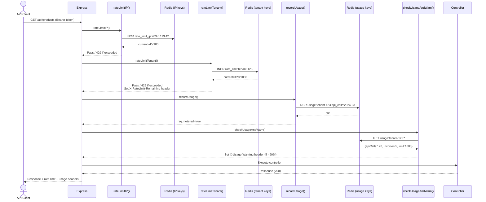

# Rate Limiting & Usage Metering Flow

## 📋 Overview

This document explains the two-tier rate limiting system and usage metering that prevent abuse, protect the API, and enforce plan-based quotas.

---

## 🎯 Why Two Systems?

| Rate Limiting | Usage Metering |
|---------------|----------------|
| **Purpose:** Prevent abuse, DoS, brute force | **Purpose:** Track consumption against plan quotas |
| **Time window:** Sliding (last hour) | **Time window:** Calendar month (reset on 1st) |
| **Action:** Block request when exceeded (429) | **Action:** Allow but track; warn when approaching limit |
| **Granularity:** Per-IP OR per-tenant | **Granularity:** Per-tenant (API calls, invoices, users, storage) |
| **Storage:** Redis (counters) | **Storage:** Redis + MongoDB persistence |
| **User sees:** Headers `X-RateLimit-Remaining` | **User sees:** Dashboard usage % + warning headers |

---

## 🏗️ Architecture

```
┌─────────────────────────────────────┐
│  Request Arrives                    │
├─────────────────────────────────────┤
│ 1. IP Rate Limit                    │ ← Global protection
│    key: rate_limit_ip:{IP}          │    100 req/hr
├─────────────────────────────────────┤
│ 2. Tenant Rate Limit                │ ← Plan-based limits
│    key: rate_limit:{tenantId}       │    trial=100, basic=1k, pro=10k/hr
├─────────────────────────────────────┤
│ 3. Usage Metering                   │ ← Track monthly usage
│    key: usage:{tenantId}:{metric}:{YYYYMM}
├─────────────────────────────────────┤
│ 4. Warning Check                    │ ← Headers if >90%
│    Header: X-Usage-Warning          │
└─────────────────────────────────────┘
```

---

## 🔄 Flow Diagram



---

## 1️⃣ IP Rate Limiting (Global)

**Middleware:** `rateLimitIP(windowMs, max)`

```javascript
exports.rateLimitIP = (windowMs = 3600000, max = 100) => {
  return async (req, res, next) => {
    const ip = req.ip || req.connection.remoteAddress;
    const key = `rate_limit_ip:${ip}`;

    const current = await redis.incr(key);
    if (current === 1) {
      await redis.pexpire(key, windowMs);
    }

    const remaining = max - current;
    res.setHeader('X-RateLimit-Limit', max);
    res.setHeader('X-RateLimit-Remaining', Math.max(remaining, 0));

    if (current > max) {
      return res.status(429).json({
        message: 'Too many requests from this IP',
        retryAfter: Math.ceil(await redis.ttl(key))
      });
    }

    next();
  };
};
```

**Applied to:** ALL `/api/` routes (before authentication)

**Purpose:**
- Prevent brute force attacks on `/api/auth/login`
- Thwart DoS from single IP
- Protect against credential stuffing

**Parameters:**
- `windowMs`: 1 hour (3,600,000ms)
- `max`: 100 requests per hour per IP

**Redis Key:** `rate_limit_ip:203.0.113.42`

**Response headers:**
```
X-RateLimit-Limit: 100
X-RateLimit-Remaining: 45
```

**Status on exceed:** `429 Too Many Requests`

```json
{
  "message": "Too many requests from this IP",
  "retryAfter": 1200  // Seconds until window resets
}
```

---

## 2️⃣ Tenant Rate Limiting (Plan-Based)

**Middleware:** `rateLimitTenant(windowMs, getMaxRequests)`

```javascript
exports.rateLimitTenant = (windowMs = 3600000, getMaxRequests) => {
  return async (req, res, next) => {
    const tenantId = req.tenantId;
    const planSlug = req.planSlug;

    const maxRequests = getMaxRequests
      ? getMaxRequests(planSlug)
      : getPlanLimit(planSlug);

    if (maxRequests === null || maxRequests === Infinity) {
      return next();  // No limit for enterprise
    }

    const key = `rate_limit:${tenantId}`;
    const current = await redis.incr(key);
    if (current === 1) {
      await redis.pexpire(key, windowMs);
    }

    const remaining = maxRequests - current;
    res.setHeader('X-RateLimit-Limit', maxRequests);
    res.setHeader('X-RateLimit-Remaining', Math.max(remaining, 0));

    if (current > maxRequests) {
      return res.status(429).json({
        message: 'API rate limit exceeded. Please upgrade your plan.',
        retryAfter: Math.ceil(await redis.ttl(key)),
        currentUsage: current,
        limit: maxRequests,
        plan: planSlug,
      });
    }

    next();
  };
};
```

**Applied to:** Protected routes (after `extractTenant`)

**Plan Limits:**
```javascript
const PLAN_LIMITS = {
  trial: 100,       // 100 requests/hour
  basic: 1000,      // 1,000/hour
  pro: 10000,       // 10,000/hour
  enterprise: null, // unlimited
};
```

**Redis Key:** `rate_limit:65f4a3b8e4b0123456789xyz`

**Response headers:**
```
X-RateLimit-Limit: 1000
X-RateLimit-Remaining: 880
```

**Status on exceed:** `429 Too Many Requests`

```json
{
  "message": "API rate limit exceeded. Please upgrade your plan.",
  "retryAfter": 1800,
  "currentUsage": 1001,
  "limit": 1000,
  "plan": "basic"
}
```

---

## 3️⃣ Usage Metering (Monthly Quotas)

**Middleware:** `recordUsage()`

**Purpose:** Track consumption against monthly quotas (API calls, invoices created, users added, storage used).

**Metrics tracked:**
| Metric | Incremented When | Plan Limit Field |
|--------|------------------|------------------|
| `api_calls` | Every API request (after auth) | `limits.apiCalls` |
| `invoices` | Sale/invoice created | `limits.invoiceCount` |
| `activeUsers` | User created/activated | `limits.activeUsers` |
| `storageMB` | File uploaded (product image, PDF) | `limits.storageMB` |

---

### **API Calls Metering**

```javascript
exports.recordUsage = async (req, res, next) => {
  const tenantId = req.tenantId;
  const now = new Date();
  const monthKey = `${now.getFullYear()}-${String(now.getMonth() + 1).padStart(2, '0')}`;

  const apiCallsKey = `usage:${tenantId}:api_calls:${monthKey}`;
  await redis.incr(apiCallsKey);

  // Set TTL to end of month
  const daysInMonth = new Date(now.getFullYear(), now.getMonth() + 1, 0).getDate();
  const secondsRemaining = daysInMonth * 86400 - (now.getDate() * 86400 + now.getHours() * 3600);
  await redis.expire(apiCallsKey, secondsRemaining);

  req.metered = true;
  next();
};
```

**Redis key format:**
```
usage:65f4a3b8e4b0123456789xyz:api_calls:2024-03: 1250
usage:65f4a3b8e4b0123456789xyz:invoices:2024-03: 15
usage:65f4a3b8e4b0123456789xyz:active_users:2024-03: 2
usage:65f4a3b8e4b0123456789xyz:storage_mb:2024-03: 234
```

**TTL:** Auto-expire at month boundary (key disappears, counter resets)

---

### **Incrementing Other Metrics**

Controllers increment specific metrics:

**Example: Sale creation (invoice count)**
```javascript
exports.create = async (req, res) => {
  // ... create sale
  const tenantId = req.tenantId;
  const monthKey = getMonthKey();  // "2024-03"
  await redis.incr(`usage:${tenantId}:invoices:${monthKey}`);
  res.status(201).json(sale);
};
```

**Example: User creation (active users)**
```javascript
exports.createUser = async (req, res) => {
  const user = await userService.create(req.body);
  if (user.status === 'active') {
    await redis.incr(`usage:${tenantId}:active_users:${monthKey}`);
  }
  res.status(201).json(user);
};
```

**Note:** `active_users` should be decremented on user deletion/deactivation (not currently done - TODO).

---

### **Storage Metering**

When file uploaded (product image):
```javascript
const fileSizeMB = buffer.length / (1024 * 1024);
await redis.incrby(`usage:${tenantId}:storage_mb:${monthKey}`, fileSizeMB);
```

---

## 4️⃣ Usage Warning (Header)

**Middleware:** `checkUsageAndWarn()`

**Purpose:** Add warning headers if tenant has exceeded 90% of plan limits.

```javascript
exports.checkUsageAndWarn = async (req, res, next) => {
  if (!req.metered || !req.tenantPlan) {
    return next();
  }

  const usage = req.tenantPlan.usage || {};  // Cached from verifyTenantAccess
  const limits = req.planDetails?.limits || {};

  const metrics = [
    { key: 'apiCalls', label: 'API Calls' },
    { key: 'invoiceCount', label: 'Invoices' },
    { key: 'activeUsers', label: 'Active Users' },
    { key: 'storageMB', label: 'Storage (MB)' },
  ];

  const warnings = [];

  metrics.forEach(({ key, label }) => {
    const current = usage[key] || 0;
    const limit = limits[key];
    if (limit && current / limit > 0.9) {  // >90%
      warnings.push(`${label}: ${current}/${limit} (${Math.round(current/limit*100)}%)`);
    }
  });

  if (warnings.length > 0) {
    res.setHeader('X-Usage-Warning', `Plan limits approaching: ${warnings.join('; ')}`);
    res.setHeader('X-Usage-Warning-Url', `${process.env.FRONTEND_URL}/settings/billing`);
  }

  next();
};
```

**Response headers (example):**
```
X-Usage-Warning: Plan limits approaching: API Calls: 950/1000 (95%); Storage (MB): 4500/5000 (90%)
X-Usage-Warning-Url: https://app.bikeflow.com/settings/billing
```

**Frontend usage:** Dashboard detects these headers and shows upgrade banner.

---

## 📊 Dashboard Integration

**Frontend calls:** `GET /api/usage/dashboard`

```javascript
// usageController.js
exports.getDashboard = async (req, res) => {
  const tenantId = req.tenantId;
  const tenantPlan = await TenantPlan.findOne({ tenantId, status: { $in: ['active', 'trialing'] } }).sort({ createdAt: -1 });
  const plan = await Plan.findById(tenantPlan.planId);

  const monthKey = getMonthKey();
  const apiCalls = await redis.get(`usage:${tenantId}:api_calls:${monthKey}`) || 0;
  const invoices = await redis.get(`usage:${tenantId}:invoices:${monthKey}`) || 0;
  const activeUsers = await redis.get(`usage:${tenantId}:active_users:${monthKey}`) || 0;
  const storage = await redis.get(`usage:${tenantId}:storage_mb:${monthKey}`) || 0;

  const usage = {
    apiCallsThisMonth: parseInt(apiCalls),
    invoiceCount: parseInt(invoices),
    activeUsers: parseInt(activeUsers),
    storageMB: parseInt(storage),
  };

  const rateLimitStatus = await getRateLimitStatus(tenantId);  // From Redis

  res.json({
    plan: {
      slug: plan.slug,
      name: plan.name,
      limits: plan.limits,
    },
    usage,
    rateLimitStatus,
    warnings: usage.apiCallsThisMonth / plan.limits.apiCalls > 0.9 ? ['API quota nearly exhausted'] : [],
  });
};
```

**Frontend displays:**
```javascript
// Dashboard.jsx
const { data } = await usageAPI.getDashboard();
setUsage(data);

// Usage bar chart
const apiPercent = (data.usage.apiCallsThisMonth / data.plan.limits.apiCalls) * 100;

return (
  <div className="usage-widget">
    <h4>API Usage</h4>
    <div className="progress-bar">
      <div className="fill" style={{ width: `${apiPercent}%` }} />
    </div>
    <span>{data.usage.apiCallsThisMonth} / {data.plan.limits.apiCalls}</span>
    {data.warnings.length > 0 && (
      <div className="warning">
        ⚠️ {data.warnings[0]}
        <a href={data.warningUrl}>Upgrade</a>
      </div>
    )}
  </div>
);
```

---

## 🔄 Monthly Reset & Sync

### **Automatic Redis Reset**

Redis keys auto-expire at month boundary because we set `EXPIRE`:
```javascript
const secondsRemaining = daysInMonth * 86400 - (now.getDate() * 86400 + now.getHours() * 3600);
await redis.expire(key, secondsRemaining);
```

When key expires → `GET` returns `null` → usage = 0

**No manual reset needed.**

---

### **Sync Usage to MongoDB (Optional)**

For historical reporting (billing reconciliation), monthly sync job:

```javascript
// scripts/syncUsageToMongo.js
async function syncUsage() {
  const now = new Date();
  const lastMonth = `${now.getFullYear()}-${String(now.getMonth()).padStart(2, '0')}`; // e.g., "2024-02"

  // Get all tenants
  const tenants = await Tenant.find({});

  for (const tenant of tenants) {
    const apiCalls = await redis.get(`usage:${tenant._id}:api_calls:${lastMonth}`) || 0;
    const invoices = await redis.get(`usage:${tenant._id}:invoices:${lastMonth}`) || 0;

    // Create UsageRecord document
    await UsageRecord.create({
      tenantId: tenant._id,
      month: lastMonth,
      apiCalls: parseInt(apiCalls),
      invoiceCount: parseInt(invoices),
    });
  }

  console.log(`✅ Synced ${tenants.length} tenants for ${lastMonth}`);
}

// Run monthly via cron or BullMQ repeatable job
```

**Why sync?**
- For billing disputes (prove usage)
- Historical reporting (trends over time)
- Calculate overage charges (if plan has soft limits)

---

## 🛡️ Bypass for Enterprise

**For enterprise customers with custom limits:**

```javascript
const getMaxRequests = (planSlug) => {
  const overrides = {
    enterprise_custom: 50000,
    enterprise_vip: null,  // unlimited
  };
  return overrides[planSlug] || PLAN_LIMITS[planSlug] || 1000;
};
```

**Or read from TenantPlan.customLimit** if overridden per tenant.

---

## 🧪 Testing Rate Limiting

### **Test 1: Exceed IP limit**

```bash
# Make 101 requests from same IP
for i in {1..101}; do
  curl -X GET http://localhost:4000/api/brandings -H "Authorization: Bearer $TOKEN" &
done
wait

# 101st request should return:
# HTTP/1.1 429 Too Many Requests
# X-RateLimit-Remaining: 0
```

---

### **Test 2: Exceed tenant limit**

```bash
# Setup: User on trial plan (limit = 100/hr)
TOKEN=$(login_trial_user)

# Make 101 requests rapidly
for i in {1..101}; do
  curl -H "Authorization: Bearer $TOKEN" http://localhost:4000/api/products
done

# Expected: 100 succeed, 101st returns 429 with:
# {
#   "message": "API rate limit exceeded. Please upgrade your plan.",
#   "limit": 100,
#   "currentUsage": 101
# }
```

---

### **Test 3: Reset after window**

```bash
# Exceed limit
for i in {1..101}; do curl ... & done

# Wait 1 hour (or manually expire Redis key)
redis-cli DEL rate_limit:tenant-123

# Try again - should work
curl -H "Authorization: Bearer $TOKEN" http://localhost:4000/api/products
# Expected: 200 OK
```

---

### **Test 4: Usage warning header**

```bash
# Force usage to 95% of limit
for i in {1..95}; do
  redis.incr("usage:tenant-123:api_calls:2024-03")
done

# Make request (tenant has limit=100)
curl -I -H "Authorization: Bearer $TOKEN" http://localhost:4000/api/products

# Response headers include:
# X-Usage-Warning: Plan limits approaching: API Calls: 95/100 (95%)
# X-Usage-Warning-Url: https://app.bikeflow.com/settings/billing
```

---

## 📈 Performance

| Operation | Redis Command | Latency |
|-----------|---------------|---------|
| IP rate limit check | INCR + EXPIRE (if first) | ~2ms |
| Tenant rate limit check | INCR + EXPIRE (if first) | ~2ms |
| Usage increment | INCR + EXPIRE (if first) | ~2ms |
| Usage warning check | MGET (4 keys) | ~1ms |

**Total middleware overhead:** ~5-10ms per request (Redis local network)

**Redis throughput:** Can handle 100k+ ops/sec easily. Rate limiting adds minimal overhead.

---

## 📊 Metrics & Monitoring

### **Key Metrics**

| Metric | Description | Alert Threshold |
|--------|-------------|-----------------|
| `rate_limit_429_total` | Count of 429 responses | >1% of total requests |
| `rate_limit_429_IP` | IP-based blocks per hour | >50 distinct IPs/hour |
| `rate_limit_429_Tenant` | Tenant plan exceed per hour | Spike >3x baseline |
| `usage_warnings_sent` | Headers added to responses | N/A (informational) |
| `redis_latency_p99` | Redis response time p99 | >50ms |

---

### **Dashboard Example**

```
Rate Limiting Dashboard (Last 24h)

┌─────────────────────────────────────────────────────┐
│ Total Requests: 1,234,567                           │
│ ✅ Allowed: 1,234,321 (99.98%)                      │
│ ❌ Rate Limited: 246 (0.02%)                        │
│    ├─ IP blocks: 123                               │
│    └─ Tenant blocks: 123                           │
├─────────────────────────────────────────────────────┤
│ Usage Warnings:                                     │
│   • API Calls: 45 tenants >90%                     │
│   • Storage: 12 tenants >90%                       │
│   • Invoices: 8 tenants >90%                       │
├─────────────────────────────────────────────────────┤
│ Top Exceeded Tenants (Last Hour):                  │
│   1. Acme Bike Shop (Basic) - 145/1000             │
│   2. Joe's Auto (Trial) - 101/100 ⚠️               │
│   3. ...                                           │
└─────────────────────────────────────────────────────┘
```

---

## 🔐 Security Considerations

1. **IP Spoofing:** Cannot spoof IP in TCP (except through proxy). Use `X-Forwarded-For` if behind load balancer (configure Express trust proxy).
2. **Redis DoS:** Redis is single point. Protect with firewall, use strong auth, consider Redis cluster for scale.
3. **Key enumeration:** Key names include tenantId - but tenantId is not secret (in JWT). No risk.
4. **Time window manipulation:** Window is server-side, cannot be manipulated by client.

---

## 🐛 Common Issues

### **Issue: Rate limits not resetting**

**Cause:** Redis `EXPIRE` not set, or wrong calculation

**Fix:** Check key TTL:
```bash
redis-cli TTL rate_limit:tenant-123
# Should return seconds until expiry (not -1)
```

If `-1` (no expiry) → bug in `pexpire` call.

---

### **Issue: Different limits for same plan**

**Cause:** `getPlanLimit(planSlug)` returning wrong value

**Fix:** Verify PLAN_LIMITS object has correct mapping:
```javascript
console.log(PLAN_LIMITS[planSlug]);  // Debug in middleware
```

---

### **Issue: Usage counters too high/lagging**

**Cause:** `recordUsage()` called multiple times per request (maybe middleware registered twice?)

**Check:** `app.js` - ensure middlewares not duplicated:
```javascript
// Correct:
app.use('/api/products', [verifyToken, extractTenant, recordUsage, ...], productRoutes);

// Wrong:
app.use('/api/products', verifyToken, extractTenant, recordUsage, verifyToken, recordUsage, ...);  // Duplicate!
```

---

## 📝 Code References

| Component | File | Lines |
|-----------|------|-------|
| Rate Limit Middleware | `BACKEND/src/middleware/rateLimitMiddleware.js` | ~100 |
| Usage Metering Middleware | `BACKEND/src/middleware/usageMeteringMiddleware.js` | ~110 |
| Plan Limits | `BACKEND/src/services/RateLimiterService.js` | ~80 |
| Usage Controller | `BACKEND/src/controllers/usageController.js` | ~150 |
| Tenant Plan model | `BACKEND/src/models/TenantPlan.js` | ~110 |

---

## 🚀 Future Improvements

1. **Adaptive rate limiting**
   - Dynamic limits based on current load (system health)
   - Throttle abusive tenants more aggressively

2. **Burst capacity**
   - Allow short bursts over limit (token bucket algorithm)
   - Current: Strict sliding window

3. **Quota increases on upgrade**
   - Immediate effect (no waiting for hour boundary)
   - Carryover unused capacity (some plans)

4. **Per-endpoint limits**
   - Cost-based model: expensive endpoints (PDF generation) cost more
   - Login endpoint separate limit (prevent lockout)

5. **Usage reset endpoint**
   - Owner can manually reset counters (if overage from bug)

6. **Real-time usage dashboard**
   - WebSocket updates for live usage graphs
   - Per-minute API call rate chart

---

**Related Documents:**
- [02-request-flow.md](02-request-flow.md) - Middleware execution order
- [07-billing-flow.md](07-billing-flow.md) - Plan limits enforcement
- [Dashboard Widget Implementation](../FRONTEND/src/components/RateLimitWidget.jsx)

---

**Next:** [10-audit-flow.md](10-audit-flow.md) - Immutable audit logging
