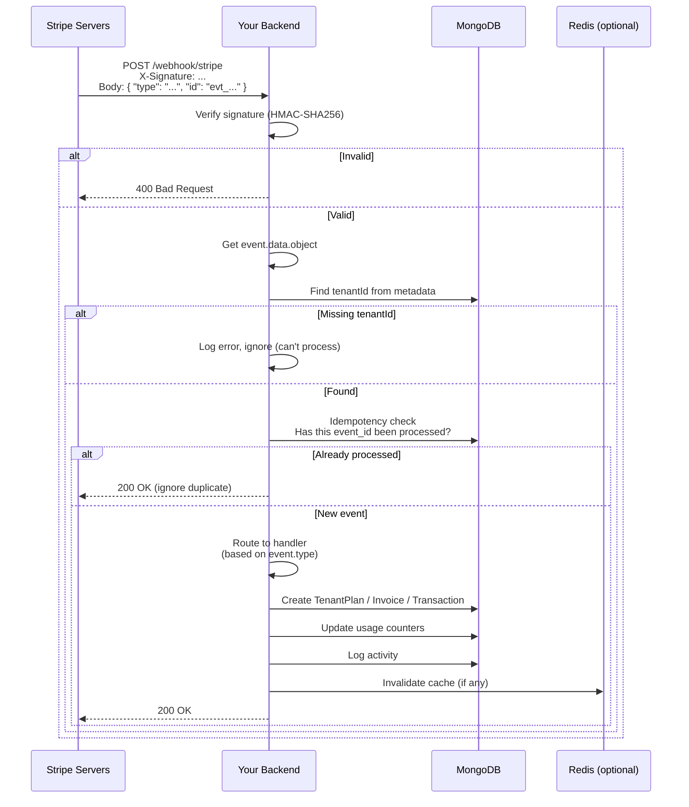

# Webhook Processing Flow

## 📋 Overview

This document details how external payment gateways (Stripe, Razorpay) notify your application of asynchronous events like successful payments, subscription updates, and failures.

---

## 🔄 Why Webhooks?

### **The Problem**

Payment gateways operate asynchronously:
1. User completes checkout on Stripe's hosted page
2. Stripe processes payment (may take seconds to days)
3. **Your app must be notified** when payment succeeds/fails
4. Cannot rely on frontend redirect alone (user may close browser)

### **The Solution**

Webhooks = HTTP callbacks from payment provider to your backend

```
Stripe → POST /api/billing/webhook/stripe → Your backend
Razorpay → POST /api/billing/webhook/razorpay → Your backend
```

---

## 🏗️ Webhook Architecture

### **Endpoint Design**

```javascript
// app.js
const { stripeWebhook, razorpayWebhook } = require('./src/controllers/billingController');

// Stripe needs RAW body for signature verification
// MUST be BEFORE express.json() middleware!
app.post('/api/billing/webhook/stripe', express.raw({ type: 'application/json' }), stripeWebhook);

// Razorpay can use normal JSON parser
app.post('/api/billing/webhook/razorpay', express.json(), razorpayWebhook);
```

**Key:** Stripe webhook registered **before** `express.json()` because it needs raw body bytes to verify signature. Razorpay doesn't need raw body.

---

## 🔐 Security: Signature Verification

### **Stripe**

**Purpose:** Prove webhook really came from Stripe (not attacker).

**How it works:**
1. Stripe sends `Stripe-Signature` header with timestamp + signature
2. You compute HMAC-SHA256 of raw body using your webhook secret
3. Compare with Stripe's signature
4. If match → webhook authentic

**Implementation:**
```javascript
const stripe = require('stripe')(process.env.STRIPE_SECRET_KEY);

exports.stripeWebhook = async (req, res) => {
  const sig = req.headers['stripe-signature'];
  let event;

  try {
    event = stripe.webhooks.constructEvent(
      req.body,        // Raw body (Buffer) - CRITICAL
      sig,
      process.env.STRIPE_WEBHOOK_SECRET
    );
  } catch (err) {
    console.error('⚠️  Webhook signature verification failed:', err.message);
    return res.status(400).send(`Webhook Error: ${err.message}`);
  }

  // event.type, event.data.object contain the event payload
  await handleStripeEvent(event);
  res.json({ received: true });
};
```

**Secret retrieval:**
- From Stripe Dashboard → Developers → Webhooks → Select endpoint → Signing secret
- Stored in `.env` as `STRIPE_WEBHOOK_SECRET=whsec_...`

---

### **Razorpay**

**Purpose:** Similar to Stripe - verify webhook authenticity.

**Implementation:**
```javascript
const Razorpay = require('razorpay');
const razorpay = new Razorpay({
  key_id: process.env.RAZORPAY_KEY_ID,
  key_secret: process.env.RAZORPAY_KEY_SECRET,
});

exports.razorpayWebhook = async (req, res) => {
  const { payload, signature } = req.headers['x-razorpay-signature'];

  const expectedSignature = razorpay.utils.generate_signature(
    JSON.stringify(req.body),
    process.env.RAZORPAY_WEBHOOK_SECRET
  );

  if (expectedSignature !== signature) {
    return res.status(400).json({ message: 'Invalid webhook signature' });
  }

  // Verified!
  await handleRazorpayEvent(req.body);
  res.json({ received: true });
};
```

**Note:** Razorpay uses different format - signature header `x-razorpay-signature`, body is JSON (not raw), needs `JSON.stringify()` to recompute signature.

---

## 📦 Webhook Event Types

### **Stripe Events**

| Event Type | Trigger | Handler |
|------------|---------|---------|
| `checkout.session.completed` | Payment succeeded via Checkout | Create subscription, activate TenantPlan |
| `invoice.payment_succeeded` | Recurring invoice paid | Record payment, extend subscription |
| `invoice.payment_failed` | Payment declined (retry) | Set status = past_due, notify user |
| `customer.subscription.updated` | Subscription modified (plan change, cancel) | Sync subscription state |
| `customer.subscription.deleted` | Subscription canceled (final) | Mark as canceled, deactivate |
| `invoice.finalized` | Invoice created (about to be paid) | Generate PDF, send email (future) |

---

### **Razorpay Events**

| Event Type | Trigger | Handler |
|------------|---------|---------|
| `payment.captured` | One-time payment captured (not subscriptions yet) | Record payment |
| `order.paid` | Order paid | Create subscription? (not fully implemented) |
| `subscription.charged` | Recurring subscription payment | Similar to Stripe invoice.payment_succeeded |

**Note:** Razorpay subscription support is partial. Most flow is Stripe-focused.

---

## 🔄 Event Handling Flow



---

## 🎯 Idempotency: The Most Critical Requirement

### **The Problem**

Webhooks can arrive:
- **Multiple times** (Stripe retries if you return non-200)
- **Out of order** (maybe `subscription.updated` before `checkout.session.completed`)
- **During downtime** (your server was down, queue of pending events)

### **Solution: Idempotency Keys**

Every Stripe/Razorpay event has unique ID:
```
Stripe event: evt_1234567890abcdef
Razorpay event: Not always provided - use order_id + event type
```

**Store processed event IDs to prevent double-processing:**

```javascript
// ProcessedEvent model (to track what we've seen)
const processedEventSchema = new mongoose.Schema({
  gateway: String,        // 'stripe' | 'razorpay'
  gatewayEventId: String, // evt_... or order_... + type
  processedAt: Date,
});

// Index for fast lookup
processedEventSchema.index({ gateway: 1, gatewayEventId: 1 }, { unique: true });

// Check before processing
const existing = await ProcessedEvent.findOne({
  gateway: 'stripe',
  gatewayEventId: event.id,
});

if (existing) {
  console.log(`⏭️  Duplicate webhook event ${event.id} - skipping`);
  return res.json({ received: true, duplicated: true });
}

// After successful processing:
await new ProcessedEvent({
  gateway: 'stripe',
  gatewayEventId: event.id,
  processedAt: new Date(),
}).save();
```

**Alternative:** Use `gatewaySubscriptionId` + `gatewayInvoiceId` + event type as idempotency key for business state updates. But separate `ProcessedEvent` model is simpler for deduplication.

---

## 📝 Handlers: Implementation Examples

### **Handler 1: `checkout.session.completed`**

**Purpose:** User just paid for subscription → activate

```javascript
async handleCheckoutSessionCompleted(session) {
  const { metadata } = session;
  const { tenantId, userId, planSlug } = metadata;

  // 1. Create TenantPlan
  const plan = await Plan.findOne({ slug: planSlug });
  const tenantPlan = new TenantPlan({
    tenantId: mongoose.Types.ObjectId(tenantId),
    planId: plan._id,
    status: 'active',
    gateway: 'stripe',
    gatewayCustomerId: session.customer,
    gatewaySubscriptionId: session.subscription,  // Stripe subscription ID
    startDate: new Date(),
    endDate: new Date(session.subscription ? session.subscription.current_period_end * 1000 : Date.now() + 30*24*60*60*1000),
    usage: { apiCallsThisMonth: 0, invoiceCount: 0, activeUsers: 1, storageMB: 0 },
  });
  await tenantPlan.save();

  // 2. Update Tenant
  await Tenant.findByIdAndUpdate(tenantId, {
    activeTenantPlanId: tenantPlan._id,
    stripeCustomerId: session.customer,
  });

  // 3. Send welcome email (future)
  // await sendEmail(tenant.email, 'subscription-activated', { plan: plan.name });

  // 4. Log activity
  await ActivityLogger.log(
    userId,
    'SUBSCRIPTION_ACTIVATED',
    'TenantPlan',
    tenantPlan._id,
    {},
    { plan: plan.name, gateway: 'stripe' }
  );

  console.log(`✅ Tenant ${tenantId} activated on plan ${planSlug}`);
}
```

---

### **Handler 2: `invoice.payment_failed`**

```javascript
async handleInvoicePaymentFailed(invoice) {
  const tenantId = invoice.customer;  // Stripe customer ID
  // But we need internal tenantId - look it up
  const tenant = await Tenant.findOne({ stripeCustomerId: tenantId });
  if (!tenant) {
    console.error(`❌ Tenaint not found for Stripe customer ${tenantId}`);
    return;
  }

  // Get active TenantPlan
  const tenantPlan = await TenantPlan.findOne({
    tenantId: tenant._id,
    gatewaySubscriptionId: invoice.subscription,
    status: 'active'
  });

  if (!tenantPlan) {
    console.error(`❌ TenantPlan not found for subscription ${invoice.subscription}`);
    return;
  }

  // Mark as past_due
  tenantPlan.status = 'past_due';
  await tenantPlan.save();

  // Log
  await ActivityLogger.log(
    null,  // system action
    'PAYMENT_FAILED',
    'TenantPlan',
    tenantPlan._id,
    { status: 'active' },
    { status: 'past_due', invoiceId: invoice.id, attemptNumber: invoice.attempt_count }
  );

  // TODO: Send email notification to tenant admin
  // await sendEmail(tenant.email, 'payment-failed', { invoiceId: invoice.number, amount: invoice.amount_due / 100 });

  console.log(`❌ Payment failed for tenant ${tenant.name}, invoice ${invoice.number}`);
}
```

---

### **Handler 3: `customer.subscription.updated`**

```javascript
async handleSubscriptionUpdated(subscription) {
  const tenant = await Tenant.findOne({ stripeCustomerId: subscription.customer });
  if (!tenant) return;

  const tenantPlan = await TenantPlan.findOne({
    tenantId: tenant._id,
    gatewaySubscriptionId: subscription.id,
  });

  if (!tenantPlan) {
    console.error(`TenantPlan not found for subscription ${subscription.id}`);
    return;
  }

  // Update status
  const newStatus = mapStripeStatus(subscription.status, subscription.cancel_at_period_end);
  tenantPlan.status = newStatus;
  tenantPlan.cancelAtPeriodEnd = subscription.cancel_at_period_end;
  tenantPlan.currentPeriodEnd = new Date(subscription.current_period_end * 1000);
  tenantPlan.updatedAt = new Date();

  await tenantPlan.save();

  // Log
  await ActivityLogger.log(
    null,
    'SUBSCRIPTION_UPDATED',
    'TenantPlan',
    tenantPlan._id,
    { status: tenantPlan.status },
    { stripeStatus: subscription.status, cancelAtPeriodEnd: subscription.cancel_at_period_end }
  );

  console.log(`🔄 Subscription ${subscription.id} updated: ${newStatus}`);
}

function mapStripeStatus(stripeStatus, cancelAtPeriodEnd) {
  if (cancelAtPeriodEnd && ['active', 'trialing', 'past_due'].includes(stripeStatus)) {
    return 'canceling';
  }
  switch (stripeStatus) {
    case 'trialing': case 'active': case 'past_due': case 'canceling':
    case 'canceled': case 'incomplete': case 'suspended':
      return stripeStatus;
    case 'unpaid':
      return 'past_due';
    case 'incomplete_expired':
      return 'canceled';
    default:
      return 'active';
  }
}
```

---

### **Handler 4: `customer.subscription.deleted`**

```javascript
async handleSubscriptionDeleted(subscription) {
  const tenant = await Tenant.findOne({ stripeCustomerId: subscription.customer });
  if (!tenant) return;

  const tenantPlan = await TenantPlan.findOne({
    tenantId: tenant._id,
    gatewaySubscriptionId: subscription.id,
    status: { $in: ['active', 'trialing', 'past_due', 'canceling'] }
  });

  if (tenantPlan) {
    tenantPlan.status = 'canceled';
    tenantPlan.endedAt = new Date();
    tenantPlan.cancelAtPeriodEnd = false;
    await tenantPlan.save();

    await Tenant.findByIdAndUpdate(tenant._id, {
      activeTenantPlanId: null,
      status: 'inactive'  // Or keep active for grace period?
    });

    await ActivityLogger.log(null, 'SUBSCRIPTION_DELETED', 'TenantPlan', tenantPlan._id, {}, {});

    console.log(`🗑️  Subscription ${subscription.id} deleted for tenant ${tenant.name}`);
  }
}
```

---

## 🧪 Testing Webhooks Locally

### **Method 1: Stripe CLI**

```bash
# Install Stripe CLI, login
stripe login

# Forward webhooks to localhost:4000
stripe listen --forward-to localhost:4000/api/billing/webhook/stripe

# Output shows webhook secret (STRIPE_WEBHOOK_SECRET)
# Add to .env

# Trigger test event
stripe trigger checkout.session.completed

# Webhook payload sent to your localhost
```

**Check logs:**
```
✅ Received Stripe event: checkout.session.completed
TenantPlan created for tenant abc123
```

---

### **Method 2: ngrok + Stripe Dashboard**

1. Start ngrok: `ngrok http 4000`
2. Get public URL: `https://abc123.ngrok.io`
3. In Stripe Dashboard → Developers → Webhooks
   - Add endpoint: `https://abc123.ngrok.io/api/billing/webhook/stripe`
   - Copy signing secret to `.env`
4. Select events to send (checkout.session.completed, invoice.payment_succeeded, etc.)
5. Trigger test from Stripe Dashboard → "Send test webhook"

---

### **Method 3: Manual cURL (for debugging)**

```bash
# Create fake Stripe event (for local testing only - won't verify signature)
# But to test signature verification, need real event from Stripe

# You can disable signature check in dev (NOT PROD):
if (process.env.NODE_ENV === 'development') {
  // Skip signature verification
} else {
  // Verify
}

# Then manually post event JSON:
curl -X POST http://localhost:4000/api/billing/webhook/stripe \
  -H "Content-Type: application/json" \
  -d '{"type":"checkout.session.completed","data":{"object":{...}}}'
```

---

## 🐛 Webhook Debugging Checklist

### **Issue: Webhook not received**

**Check:**
1. Stripe Dashboard → Developers → Webhooks → Is endpoint configured?
2. Is your server publicly accessible? (use ngrok for local)
3. Check server logs: "Received Stripe event"
4. Check Stripe Dashboard → Webhooks → Recent attempts (status, response code)

---

### **Issue: 400 Bad Request - signature verification failed**

**Causes:**
1. `STRIPE_WEBHOOK_SECRET` mismatched (wrong secret)
2. Raw body not passed (if using `express.json()` before webhook route)
3. Webhook sent to wrong endpoint

**Fix:**
- Ensure webhook route is BEFORE `express.json()` in `app.js`
- Verify secret matches Stripe Dashboard
- Check endpoint URL in Stripe Dashboard

---

### **Issue: Duplicate processing**

**Symptoms:** Same event processed twice (2 TenantPlan rows created)

**Cause:** Missing idempotency check

**Fix:**
```javascript
const eventId = event.id;  // Stripe event ID
const existing = await ProcessedEvent.findOne({ gatewayEventId: eventId });
if (existing) {
  return res.json({ received: true, duplicated: true });
}
// ... process ...
await new ProcessedEvent({ gatewayEventId: eventId }).save();
```

---

### **Issue: Tenant not found**

**Cause:** `metadata.tenantId` missing from Stripe Checkout Session

**Fix:** In `BillingService.createCheckoutSession`, ensure metadata includes `tenantId`:
```javascript
const session = await stripe.checkout.sessions.create({
  // ...
  metadata: {
    tenantId: tenant._id.toString(),
    userId: userId.toString(),
    planSlug: plan.slug,
  }
});
```

---

## 📊 Webhook Delivery Guarantees

**Stripe retry schedule:**
- If your endpoint returns non-2xx → Stripe retries
- Exponential backoff: 5sec, 30sec, 1min, 5min, 30min, 2hr, 6hr, 12hr, 24hr
- Total: ~3 days of retries

**Your responsibility:**
- Return `200 OK` quickly (within 30 seconds, ideally <5s)
- Process asynchronously if heavy work (e.g., generate PDF, send email)
- Use idempotency keys to safely retry

---

## 🔄 Retry Logic (Your Side)

If your DB goes down during webhook processing:

```javascript
exports.stripeWebhook = async (req, res) => {
  try {
    const event = stripe.webhooks.constructEvent(...);

    // Process synchronously for now
    await handleStripeEvent(event);

    // Only respond after DB writes complete
    res.json({ received: true });
  } catch (err) {
    console.error('Webhook processing failed:', err);
    // Return 500 so Stripe retries
    res.status(500).json({ error: 'Processing failed' });
  }
};
```

**Better (async with BullMQ):**
```javascript
// Queue job for background processing
await webhookQueue.add('stripe-event', {
  eventId: event.id,
  type: event.type,
  object: event.data.object,
});

// Respond 200 immediately
res.json({ received: true });

// BullMQ worker processes job with retries
```

---

## 📈 Monitoring Webhooks

### **Metrics to Track**

1. **Received rate** (events/sec) - spike indicates payment surge
2. **Success rate** - 99%+ should return 200 OK
3. **Processing latency** - p99 < 5 seconds
4. **Duplicate rate** - should be ~0% (idempotency working)
5. **Failed events** - alert if >1% fail

### **Dashboard**

```
┌─────────────────────────────────────────┐
│  Stripe Webhooks (24h)                  │
├─────────────────────────────────────────┤
│ Received: 1,234                         │
│ ✅ Success: 1,231 (99.8%)               │
│ ❌ Failed: 3 (0.2%)                     │
│ ⏭️  Duplicates: 0                      │
│ Avg Latency: 245ms                     │
│ p99 Latency: 1.2s                     │
└─────────────────────────────────────────┘
```

---

## 🔐 Security Checklist

- [x] Verify Stripe signature (`stripe.webhooks.constructEvent`)
- [x] Verify Razorpay signature (`razorpay.utils.generate_signature`)
- [x] Use HTTPS endpoints only (no HTTP in production)
- [x] Validate event type before processing (whitelist)
- [x] Idempotency check (gatewayEventId)
- [x] TenantId from metadata (not attacker-controlled)
- [ ] Rate limit webhook endpoint (prevent DoS, but Stripe IPs are trusted)
- [ ] Log all webhook attempts (success/failure)
- [ ] Alert on high failure rate

---

## 🧪 Webhook Testing Scenarios

### **Scenario 1: Simulate Stripe payment success**

```bash
# 1. Create checkout session (as user)
TOKEN=...
curl -X POST /api/billing/create-checkout-session -H "Authorization: Bearer $TOKEN" -d '{"planSlug":"basic"}'
# → { "url": "https://checkout.stripe.com/..." }

# 2. Manually complete checkout in Stripe test mode (use test card 4242...)
# Or use Stripe CLI to trigger event:
stripe trigger checkout.session.completed

# 3. Check DB:
# - TenantPlan exists with status "active"
# - Tenant.activeTenantPlanId set
```

---

### **Scenario 2: Simulate payment failure**

```bash
stripe trigger invoice.payment_failed
# Parameters: customer (customer_id), subscription (subscription_id),invoice (invoice_id)

# Or with custom amount to test:
stripe trigger invoice.payment_failed --add invoice:amount_due=1000

# Check DB: TenantPlan status should be "past_due"
```

---

### **Scenario 3: Duplicate event (retry)**

```bash
# Send same event ID twice (Stripe only sends each event once, but test your idempotency)
# Strip -i flag shows you can manually resend event from Dashboard
# Should log "duplicate - skipping"
```

---

## 📚 Webhook Best Practices

1. **Respond quickly** - Long processing → Stripe retries (causing duplicates)
2. **Idempotency** - Always check if already processed
3. **Log everything** - Event ID, type, tenantId, processing result
4. **Handle unknown events** - Stripe adds new event types, don't crash
5. **Async processing** - Use BullMQ for heavy jobs (PDF, email)
6. **Monitor** - Alert on failure rate spikes
7. **Test locally** - Use Stripe CLI for realistic testing

---

## 📝 Webhook Failure Recovery

**If your server is down for 2 hours**, Stripe will retry webhooks for hours/days.

**When server comes back up:**
1. Stripe resumes retry schedule
2. You receive queued events
3. Idempotency keys prevent double-processing
4. All missed events processed eventually

**Manual catch-up (if needed):**
```bash
# Pull missed events from Stripe API
stripe events list --limit 100 --created gte:$(date -d '2 hours ago' +%s)

# Or use Stripe Dashboard → Developers → Events → Search/filter → Redeliver
```

---

## 🎯 Webhook Code Structure

**Recommended organization:**

```
BACKEND/src/
├── controllers/
│   └── billingController.js  # Webhook entry functions
├── services/
│   ├── StripeService.js      # Stripe API wrapper
│   ├── RazorpayService.js    # Razorpay API wrapper
│   └── WebhookHandler.js     # Central dispatcher
├── models/
│   ├── TenantPlan.js
│   ├── TenantInvoice.js
│   ├── TenantTransaction.js
│   └── ProcessedEvent.js     # Idempotency tracking
└── utils/
    └── webhookClassifier.js  # Route events to handlers
```

---

## 📊 Complete Webhook Processing Log

```javascript
// Example log entry (structured logging future)
{
  "timestamp": "2024-03-15T10:30:00Z",
  "gateway": "stripe",
  "eventId": "evt_1234567890abcdef",
  "eventType": "checkout.session.completed",
  "tenantId": "65f4a3b8e4b0123456789xyz",
  "processingTimeMs": 145,
  "duplicate": false,
  "status": "success",
  "error": null,
  "actions": [
    "Created TenantPlan",
    "Updated Tenant.activeTenantPlanId",
    "Logged activity SIGNUP"
  ]
}
```

---

**Next Steps:** Implement comprehensive logging, add BullMQ for async, monitor delivery rates, add alerting for failures.

---

**Related:**
- [07-billing-flow.md](07-billing-flow.md) - Billing lifecycle
- [02-request-flow.md](02-request-flow.md) - Where webhooks fit in request flow
